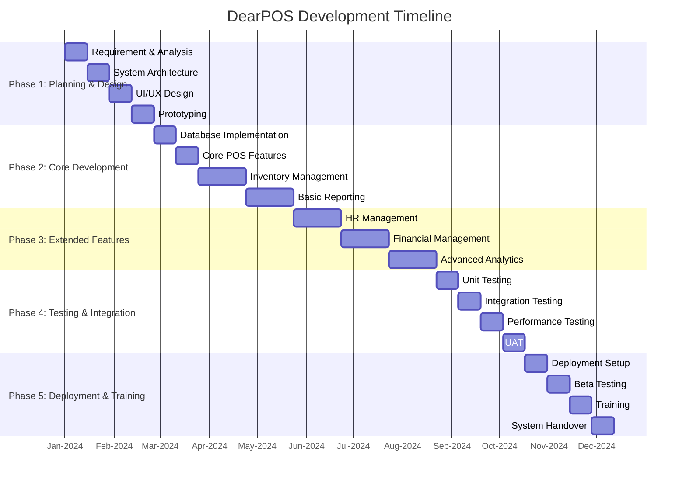
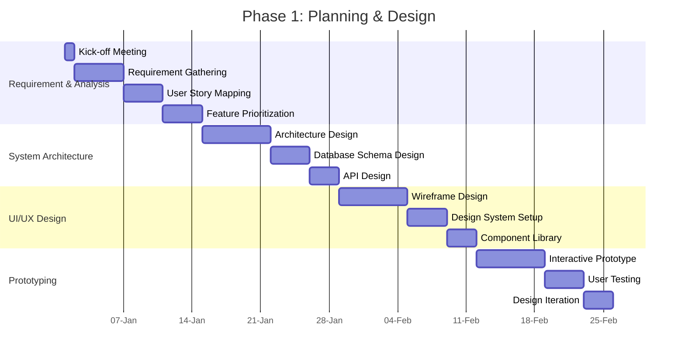
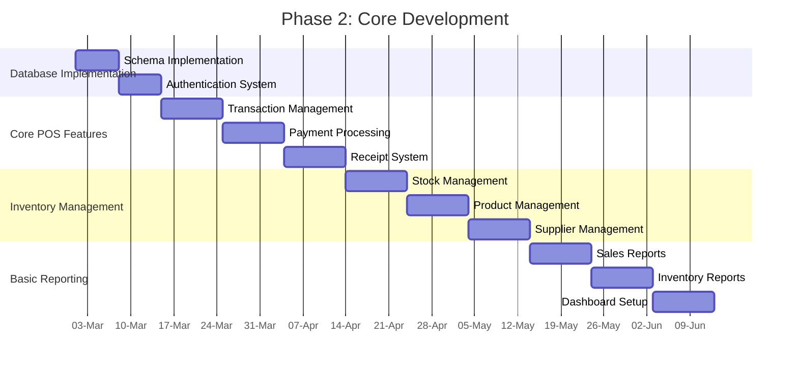
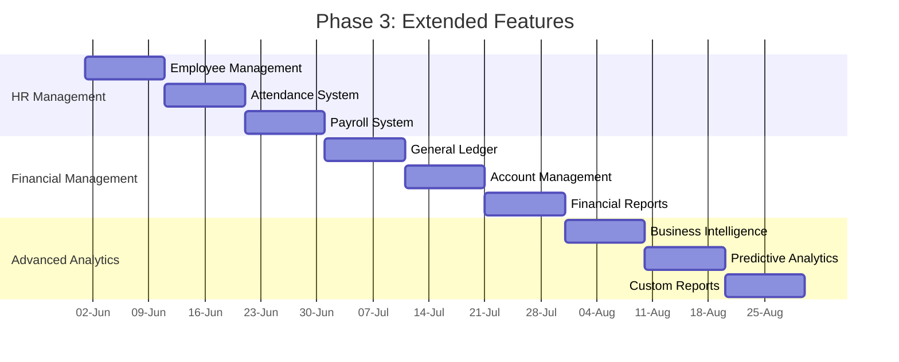
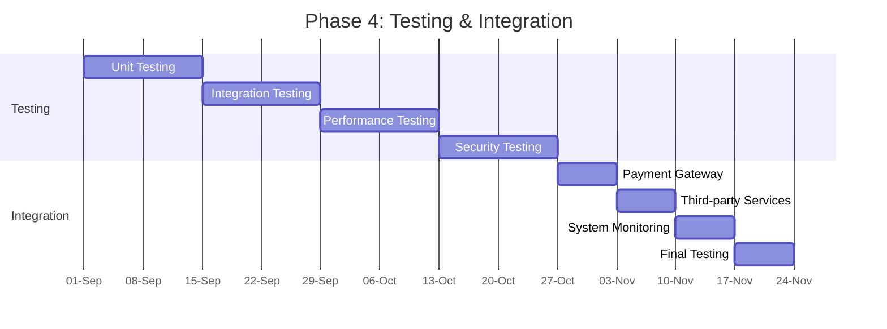
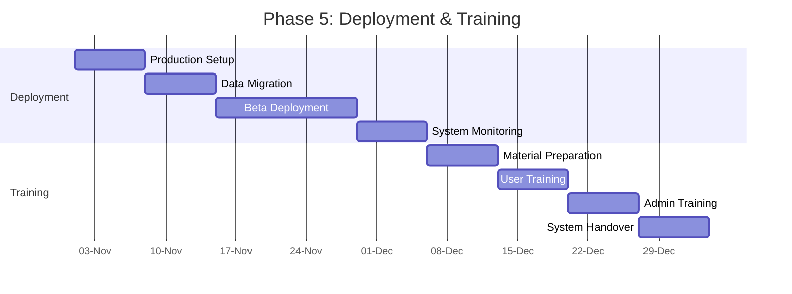
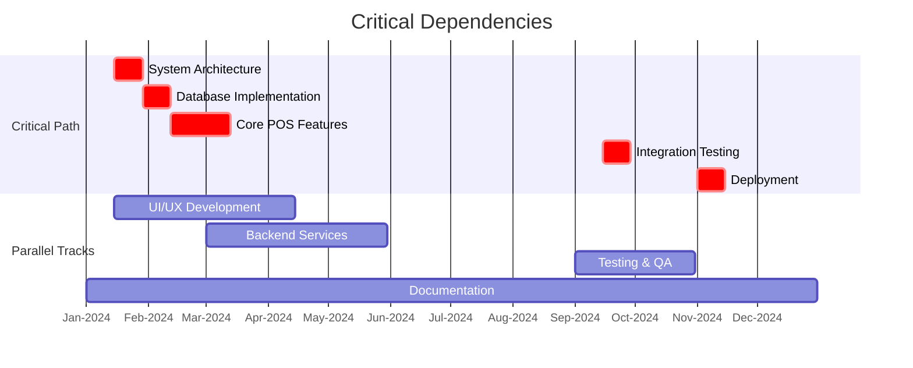

# Gantt Chart DearPOS

## Project Timeline Overview

## Detailed Phase 1: Planning & Design

## Detailed Phase 2: Core Development

## Detailed Phase 3: Extended Features

## Detailed Phase 4: Testing & Integration

## Detailed Phase 5: Deployment & Training

## Critical Dependencies

---
*Note: Tanggal dalam Gantt chart ini adalah indikatif dan dapat disesuaikan berdasarkan kebutuhan proyek.*
