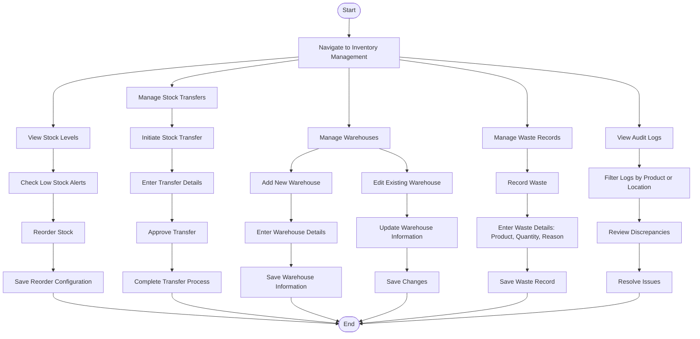

### **Penjelasan Diagram:**
1. **Stock Management Workflow:**
   - Melihat level stok.
   - Mengatur konfigurasi stok ulang berdasarkan alert stok rendah.

2. **Stock Transfer Workflow:**
   - Menginisiasi transfer stok antar lokasi/gudang.
   - Memasukkan detail transfer dan menyelesaikan proses transfer.

3. **Warehouse Management Workflow:**
   - Menambah, mengedit, atau memperbarui informasi gudang.

4. **Waste Management Workflow:**
   - Mencatat limbah produk, termasuk alasan dan jumlah yang dibuang.

5. **Audit Log Workflow:**
   - Melihat dan memfilter log audit untuk stok.
   - Meninjau dan menyelesaikan ketidaksesuaian dalam catatan inventori.
