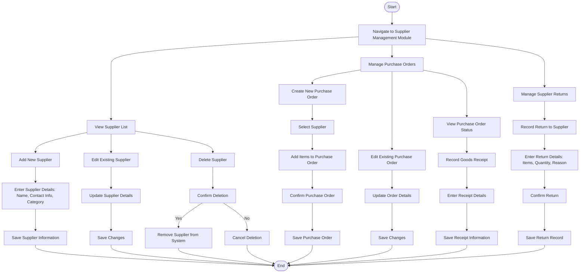

### **Penjelasan Diagram:**
1. **Supplier Management Workflow:**
   - Menambahkan, mengedit, atau menghapus pemasok.
   - Memasukkan detail pemasok seperti nama, kontak, dan kategori.

2. **Purchase Order Workflow:**
   - Membuat pesanan pembelian baru dengan memilih pemasok dan menambahkan barang.
   - Mengedit atau memperbarui pesanan pembelian yang ada.

3. **Goods Receipt Workflow:**
   - Mencatat penerimaan barang untuk pesanan pembelian.
   - Memasukkan detail penerimaan seperti jumlah barang dan kondisi barang.

4. **Supplier Return Workflow:**
   - Mencatat pengembalian barang ke pemasok dengan alasan dan kuantitas.
