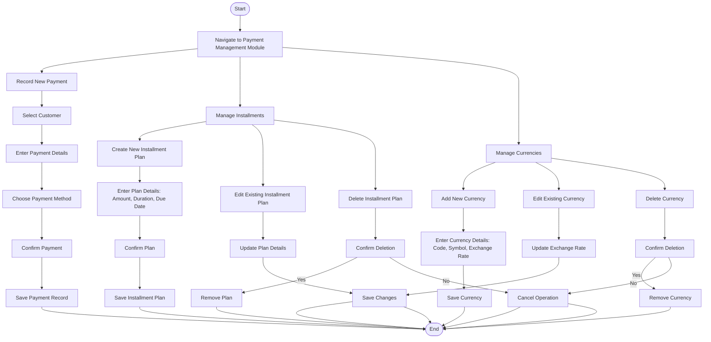

### **Penjelasan Diagram:**
1. **Payment Recording Workflow:**
   - Merekam pembayaran baru, memilih pelanggan, memasukkan detail pembayaran, dan metode pembayaran.

2. **Installment Management Workflow:**
   - Membuat rencana cicilan baru, mengedit, atau menghapus rencana cicilan yang ada.

3. **Currency Management Workflow:**
   - Menambah mata uang baru, memperbarui nilai tukar, atau menghapus mata uang dari sistem.
