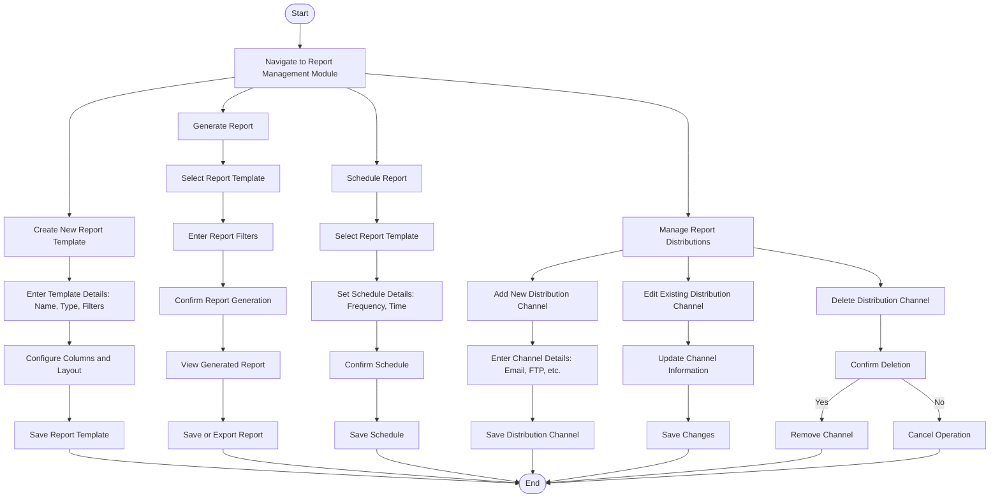

### **Penjelasan Diagram:**
1. **Report Template Creation Workflow:**
   - Membuat template laporan baru dengan detail seperti nama, jenis, dan filter.
   - Mengonfigurasi kolom dan tata letak laporan.

2. **Report Generation Workflow:**
   - Memilih template laporan, memasukkan filter, dan menghasilkan laporan.
   - Menyimpan atau mengekspor laporan yang dihasilkan.

3. **Report Scheduling Workflow:**
   - Menjadwalkan laporan dengan memilih template dan mengatur frekuensi serta waktu.

4. **Report Distribution Workflow:**
   - Menambah, mengedit, atau menghapus saluran distribusi laporan, seperti email atau FTP.