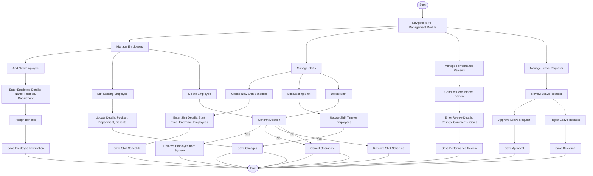

### **Penjelasan Diagram:**
1. **Employee Management Workflow:**
   - Menambahkan, mengedit, atau menghapus data karyawan.
   - Mengelola informasi seperti posisi, departemen, dan manfaat.

2. **Shift Management Workflow:**
   - Membuat jadwal shift baru, memperbarui jadwal shift, atau menghapus jadwal yang ada.

3. **Performance Review Workflow:**
   - Melakukan evaluasi kinerja karyawan dengan memberikan penilaian, komentar, dan menetapkan tujuan.

4. **Leave Request Workflow:**
   - Meninjau permohonan cuti karyawan, memberikan persetujuan, atau menolak permohonan.