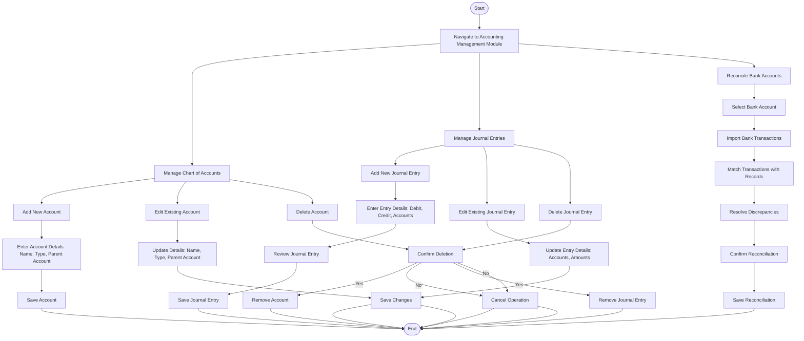

### **Penjelasan Diagram:**
1. **Chart of Accounts Management Workflow:**
   - Menambahkan, mengedit, atau menghapus akun keuangan dalam struktur akun.

2. **Journal Entries Workflow:**
   - Membuat entri jurnal baru, memperbarui entri yang ada, atau menghapus entri jurnal.

3. **Bank Reconciliation Workflow:**
   - Memilih akun bank, mengimpor transaksi, mencocokkan transaksi dengan catatan sistem, dan menyelesaikan rekonsiliasi.