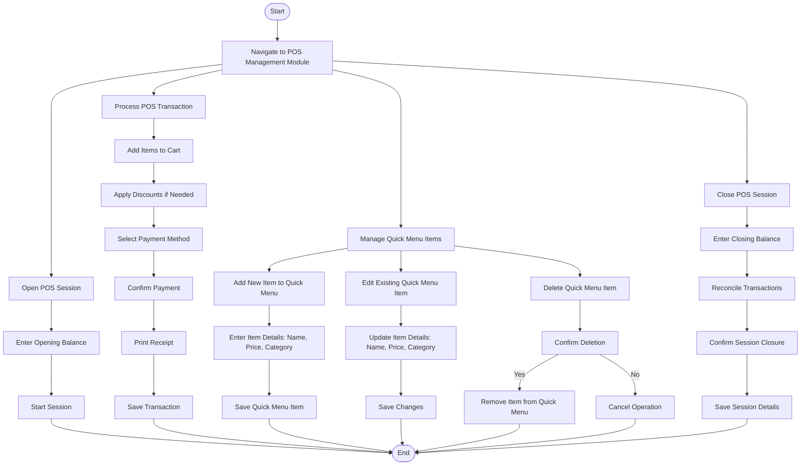

### **Penjelasan Diagram:**
1. **Open POS Session Workflow:**
   - Membuka sesi POS dengan memasukkan saldo awal dan memulai sesi.

2. **POS Transaction Workflow:**
   - Memproses transaksi POS, termasuk menambahkan item, menerapkan diskon, memilih metode pembayaran, dan mencetak struk.

3. **Quick Menu Management Workflow:**
   - Menambah, mengedit, atau menghapus item di menu cepat untuk mempermudah transaksi.

4. **Close POS Session Workflow:**
   - Menutup sesi POS dengan memasukkan saldo akhir, merekonsiliasi transaksi, dan menyimpan detail sesi.