```mermaid
graph TD
    Start([Start]) --> NavigateToSettingsManagement[Navigate to Settings Management Module]

    NavigateToSettingsManagement --> ManageGeneralSettings[Manage General Settings]
    ManageGeneralSettings --> UpdateCompanyInfo[Update Company Information]
    UpdateCompanyInfo --> SaveCompanyInfo[Save Changes]
    SaveCompanyInfo --> End([End])

    ManageGeneralSettings --> ConfigurePreferences[Configure System Preferences]
    ConfigurePreferences --> SavePreferences[Save Preferences]
    SavePreferences --> End

    NavigateToSettingsManagement --> ManageBackupSettings[Manage Backup Settings]
    ManageBackupSettings --> CreateBackupSchedule[Create Backup Schedule]
    CreateBackupSchedule --> EnterScheduleDetails[Enter Backup Frequency and Time]
    EnterScheduleDetails --> SaveBackupSchedule[Save Backup Schedule]
    SaveBackupSchedule --> End

    ManageBackupSettings --> RestoreBackup[Restore Backup Data]
    RestoreBackup --> SelectBackup[Select Backup File]
    SelectBackup --> ConfirmRestore[Confirm Restore Action]
    ConfirmRestore --> ExecuteRestore[Execute Restore]
    ExecuteRestore --> End

    NavigateToSettingsManagement --> ManageEmailTemplates[Manage Email Templates]
    ManageEmailTemplates --> AddEmailTemplate[Add New Email Template]
    AddEmailTemplate --> EnterTemplateDetails[Enter Template Subject and Body]
    EnterTemplateDetails --> SaveTemplate[Save Email Template]
    SaveTemplate --> End

    ManageEmailTemplates --> EditEmailTemplate[Edit Existing Template]
    EditEmailTemplate --> UpdateTemplateDetails[Update Subject or Body]
    UpdateTemplateDetails --> SaveChanges[Save Changes]
    SaveChanges --> End

    ManageEmailTemplates --> DeleteEmailTemplate[Delete Email Template]
    DeleteEmailTemplate --> ConfirmDeletion[Confirm Deletion]
    ConfirmDeletion -->|Yes| RemoveTemplate[Remove Template]
    RemoveTemplate --> End
    ConfirmDeletion -->|No| CancelOperation[Cancel Operation]
    CancelOperation --> End

    NavigateToSettingsManagement --> ManageIntegrations[Manage Integrations]
    ManageIntegrations --> AddIntegration[Add New Integration]
    AddIntegration --> EnterIntegrationDetails[Enter API Keys or Configuration]
    EnterIntegrationDetails --> SaveIntegration[Save Integration Details]
    SaveIntegration --> End

    ManageIntegrations --> EditIntegration[Edit Existing Integration]
    EditIntegration --> UpdateIntegrationDetails[Update API Keys or Configuration]
    UpdateIntegrationDetails --> SaveChanges[Save Changes]
    SaveChanges --> End

    ManageIntegrations --> DeleteIntegration[Delete Integration]
    DeleteIntegration --> ConfirmDeletion[Confirm Deletion]
    ConfirmDeletion -->|Yes| RemoveIntegration[Remove Integration]
    RemoveIntegration --> End
    ConfirmDeletion -->|No| CancelOperation[Cancel Operation]
    CancelOperation --> End
```

### **Penjelasan Diagram:**
1. **General Settings Workflow:**
   - Memperbarui informasi perusahaan atau preferensi sistem.
   - Menyimpan perubahan konfigurasi.

2. **Backup Management Workflow:**
   - Menjadwalkan pencadangan data dan melakukan pemulihan data dari cadangan sebelumnya.

3. **Email Template Management Workflow:**
   - Menambah, mengedit, atau menghapus template email yang digunakan dalam sistem.

4. **Integration Management Workflow:**
   - Menambah, memperbarui, atau menghapus konfigurasi integrasi dengan API eksternal atau layanan lainnya.