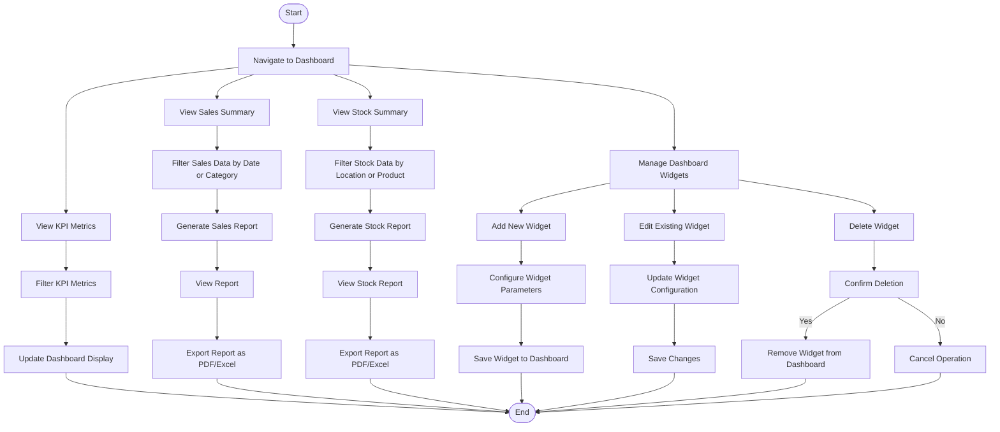

### **Penjelasan Diagram:**
1. **KPI Metrics Workflow:**
   - Melihat metrik KPI, memfilter data, dan memperbarui tampilan dashboard.

2. **Sales Summary Workflow:**
   - Melihat ringkasan penjualan, memfilter data, menghasilkan laporan, dan mengekspor laporan.

3. **Stock Summary Workflow:**
   - Melihat ringkasan stok, memfilter data berdasarkan lokasi atau produk, dan menghasilkan laporan.

4. **Widget Management Workflow:**
   - Menambah, mengedit, atau menghapus widget di dashboard.