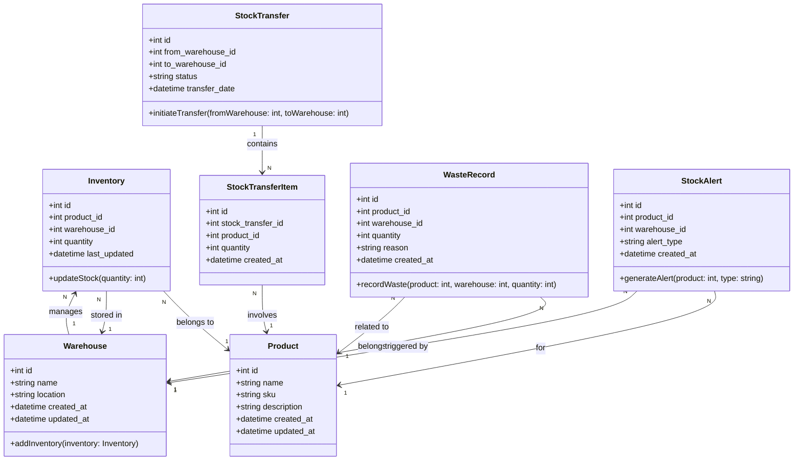

### **Penjelasan Class Diagram:**
1. **Inventory Class:**
   - Menyimpan jumlah stok untuk setiap produk di gudang tertentu.
   - Metode `updateStock` digunakan untuk memperbarui stok.

2. **Warehouse Class:**
   - Representasi gudang tempat penyimpanan produk.
   - Dapat memiliki banyak entri stok.

3. **StockTransfer Class:**
   - Mewakili transfer stok antar gudang, dengan status transfer dan tanggal.
   - Relasi ke **StockTransferItem** yang mencatat produk dan jumlah yang ditransfer.

4. **StockTransferItem Class:**
   - Detil produk yang termasuk dalam transfer stok.

5. **WasteRecord Class:**
   - Mencatat barang yang dibuang dari inventori dengan alasan dan jumlah tertentu.

6. **StockAlert Class:**
   - Mencatat alert stok rendah, stok kedaluwarsa, atau overstock.

---

### **Relasi:**
- **Inventory** memiliki relasi ke **Product** dan **Warehouse**.
- **Warehouse** dapat memiliki banyak entri **Inventory**.
- **StockTransfer** memiliki banyak **StockTransferItem**.
- **WasteRecord** terkait dengan **Product** dan **Warehouse**.
- **StockAlert** terkait dengan **Product** dan **Warehouse**.