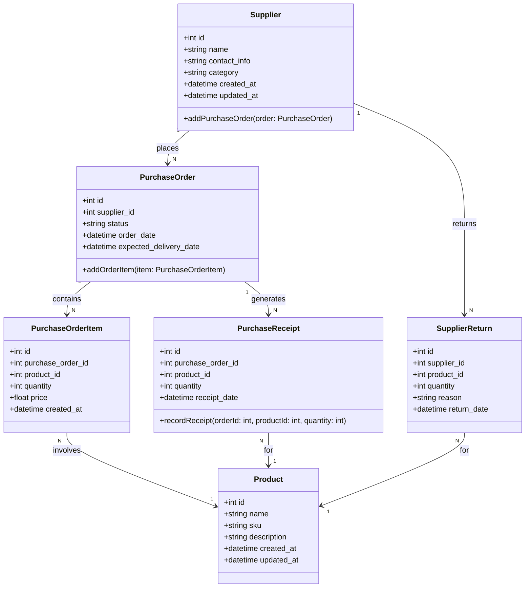

### **Penjelasan Class Diagram:**
1. **Supplier Class:**
   - Representasi pemasok, menyimpan informasi kontak dan kategori.
   - Memiliki relasi ke **PurchaseOrder** untuk pesanan yang ditempatkan.

2. **PurchaseOrder Class:**
   - Menyimpan detail pesanan pembelian, seperti status, tanggal pesanan, dan tanggal pengiriman yang diharapkan.
   - Relasi ke **PurchaseOrderItem** untuk mencatat produk dalam pesanan.

3. **PurchaseOrderItem Class:**
   - Detail produk dalam pesanan, termasuk jumlah dan harga per unit.

4. **SupplierReturn Class:**
   - Mencatat pengembalian barang ke pemasok, dengan alasan dan jumlah pengembalian.

5. **PurchaseReceipt Class:**
   - Mewakili barang yang diterima dari pemasok berdasarkan pesanan pembelian.

---

### **Relasi:**
- **Supplier** memiliki banyak **PurchaseOrder**.
- **PurchaseOrder** memiliki banyak **PurchaseOrderItem**.
- **Supplier** memiliki banyak **SupplierReturn**.
- **PurchaseOrder** menghasilkan banyak **PurchaseReceipt**.
