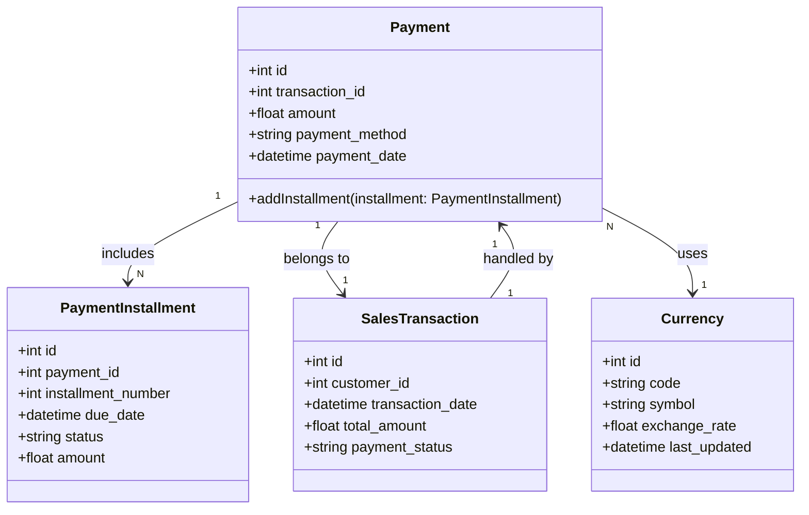

### **Penjelasan Class Diagram:**
1. **Payment Class:**
   - Representasi pembayaran, termasuk detail jumlah, metode pembayaran, dan tanggal pembayaran.
   - Relasi ke **PaymentInstallment** untuk mencatat cicilan.

2. **PaymentInstallment Class:**
   - Menyimpan detail cicilan pembayaran seperti nomor cicilan, tanggal jatuh tempo, status, dan jumlah cicilan.

3. **Currency Class:**
   - Menyimpan informasi mata uang seperti kode, simbol, dan nilai tukar.

4. **SalesTransaction Class:**
   - Mewakili transaksi penjualan yang terkait dengan pembayaran.

---

### **Relasi:**
- **Payment** memiliki banyak **PaymentInstallment**.
- **Payment** terkait dengan satu **SalesTransaction**.
- **Payment** menggunakan satu **Currency**.
