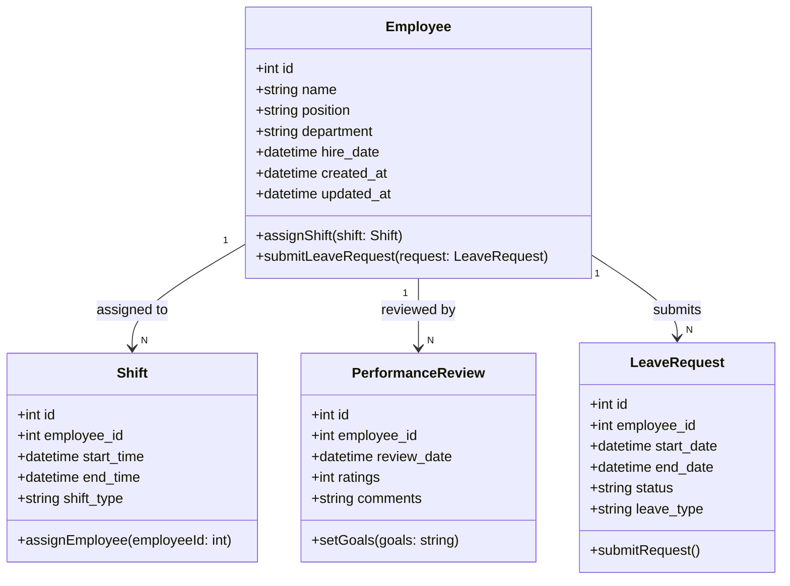

### **Penjelasan Class Diagram:**
1. **Employee Class:**
   - Menyimpan informasi karyawan seperti nama, posisi, departemen, dan tanggal mulai bekerja.
   - Metode: `assignShift()` untuk menjadwalkan shift dan `submitLeaveRequest()` untuk permohonan cuti.

2. **Shift Class:**
   - Representasi jadwal kerja karyawan, termasuk waktu mulai, waktu selesai, dan jenis shift.
   - Setiap shift terkait dengan satu karyawan.

3. **PerformanceReview Class:**
   - Menyimpan ulasan kinerja karyawan dengan detail seperti tanggal ulasan, penilaian, komentar, dan tujuan yang ditetapkan.

4. **LeaveRequest Class:**
   - Mewakili permohonan cuti karyawan, termasuk jenis cuti, tanggal mulai, tanggal selesai, dan status.

---

### **Relasi:**
- **Employee** memiliki banyak **Shift**, **PerformanceReview**, dan **LeaveRequest**.
- **Shift** terhubung ke satu karyawan untuk setiap jadwal.
- **PerformanceReview** mencatat evaluasi kinerja untuk setiap karyawan.
