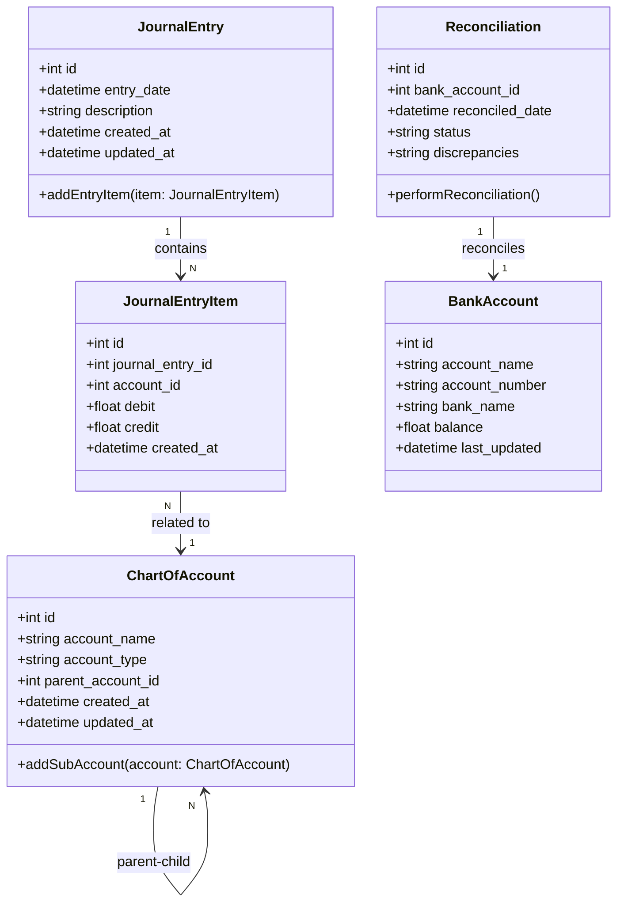

### **Penjelasan Class Diagram:**
1. **ChartOfAccount Class:**
   - Representasi akun keuangan, mendukung hierarki melalui atribut `parent_account_id`.
   - Metode `addSubAccount()` digunakan untuk menambahkan akun anak.

2. **JournalEntry Class:**
   - Mewakili entri jurnal keuangan, termasuk tanggal entri, deskripsi, dan waktu pembuatan.
   - Relasi ke **JournalEntryItem** untuk detail debit dan kredit.

3. **JournalEntryItem Class:**
   - Detail entri jurnal mencatat akun yang digunakan, nilai debit, dan nilai kredit.

4. **Reconciliation Class:**
   - Mewakili rekonsiliasi bank, mencatat tanggal rekonsiliasi, status, dan selisih transaksi.

5. **BankAccount Class:**
   - Informasi akun bank, termasuk nama akun, nomor akun, nama bank, dan saldo terakhir.

---

### **Relasi:**
- **ChartOfAccount** memiliki relasi parent-child untuk mendukung hierarki.
- **JournalEntry** memiliki banyak **JournalEntryItem**.
- **JournalEntryItem** terkait dengan **ChartOfAccount**.
- **Reconciliation** terkait dengan satu **BankAccount**.
