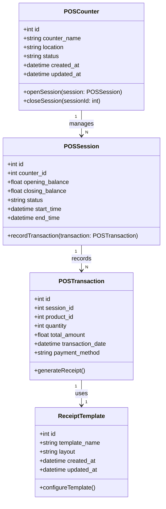

### **Penjelasan Class Diagram:**
1. **POSCounter Class:**
   - Representasi setiap counter (mesin POS), menyimpan lokasi dan status counter.
   - Metode `openSession()` dan `closeSession()` untuk mengelola sesi POS.

2. **POSSession Class:**
   - Mewakili sesi POS, termasuk saldo awal, saldo akhir, waktu mulai, dan waktu selesai sesi.
   - Relasi ke **POSTransaction** untuk mencatat transaksi selama sesi berlangsung.

3. **POSTransaction Class:**
   - Menyimpan detail transaksi POS, termasuk produk, kuantitas, total, dan metode pembayaran.
   - Metode `generateReceipt()` digunakan untuk membuat struk.

4. **ReceiptTemplate Class:**
   - Template yang digunakan untuk menghasilkan struk, termasuk tata letak dan desain.

---

### **Relasi:**
- **POSCounter** memiliki banyak **POSSession**.
- **POSSession** mencatat banyak **POSTransaction**.
- **POSTransaction** menggunakan satu **ReceiptTemplate** untuk membuat struk.
