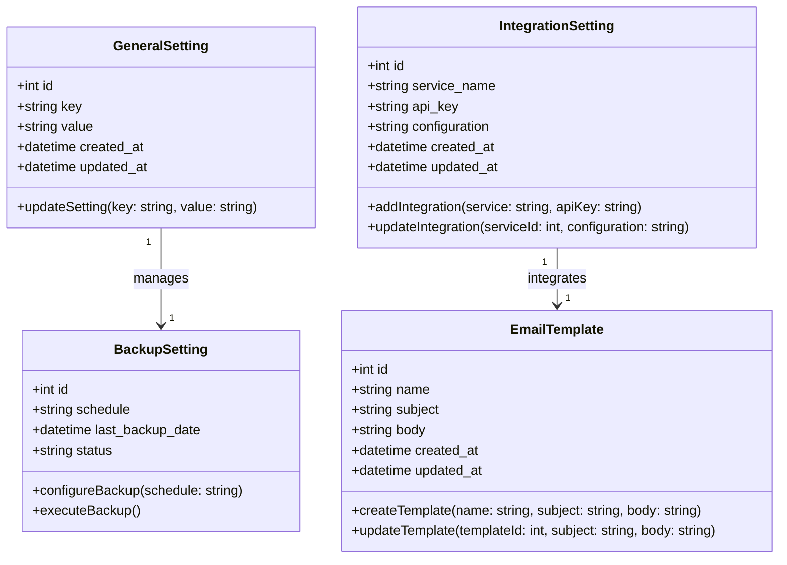

### **Penjelasan Class Diagram:**
1. **GeneralSetting Class:**
   - Menyimpan pengaturan umum sistem, seperti kunci konfigurasi dan nilainya.
   - Metode: `updateSetting()` untuk memperbarui pengaturan sistem.

2. **BackupSetting Class:**
   - Mewakili jadwal pencadangan, status, dan tanggal pencadangan terakhir.
   - Metode: `configureBackup()` untuk mengatur jadwal pencadangan dan `executeBackup()` untuk menjalankan pencadangan.

3. **EmailTemplate Class:**
   - Menyimpan template email, termasuk nama, subjek, dan isi email.
   - Metode: `createTemplate()` untuk membuat template baru dan `updateTemplate()` untuk memperbarui template yang ada.

4. **IntegrationSetting Class:**
   - Menyimpan konfigurasi integrasi API atau layanan eksternal.
   - Metode: `addIntegration()` untuk menambah layanan baru dan `updateIntegration()` untuk memperbarui konfigurasi layanan.

---

### **Relasi:**
- **GeneralSetting** mengelola **BackupSetting** untuk konfigurasi pencadangan.
- **IntegrationSetting** terkait dengan **EmailTemplate** untuk pengiriman email.
