# Entity Relationship Diagram - DearPOS

## Overview
Dokumen ini menjelaskan hubungan antar entitas dalam sistem DearPOS berdasarkan struktur database yang telah didefinisikan.

## Database Diagram

```mermaid
erDiagram
    Users ||--o{ Sessions : has
    Users ||--o{ UserRoles : has
    Users ||--o{ Activities : logs
    
    Roles ||--o{ UserRoles : has
    Roles ||--o{ RolePermissions : has
    Permissions ||--o{ RolePermissions : has
    
    Products ||--o{ ProductVariants : has
    Products ||--o{ ProductPrices : has
    Products ||--o{ ProductImages : has
    Products ||--o{ ProductCategories : belongs_to
    Products ||--o{ InventoryMovements : has
    
    ProductVariants ||--o{ InventoryMovements : has
    ProductVariants ||--o{ OrderItems : contains
    
    Orders ||--o{ OrderItems : contains
    Orders ||--o{ OrderPayments : has
    Orders ||--o{ OrderStatuses : has
    
    Customers ||--o{ Orders : places
    Customers ||--o{ CustomerAddresses : has
    Customers ||--o{ CustomerContacts : has
    
    Suppliers ||--o{ PurchaseOrders : receives
    Suppliers ||--o{ SupplierProducts : supplies
    
    PurchaseOrders ||--o{ PurchaseOrderItems : contains
    PurchaseOrders ||--o{ InventoryMovements : triggers
    
    Employees ||--o{ EmployeeSchedules : has
    Employees ||--o{ EmployeeAttendances : records
    Employees ||--o{ PayrollItems : receives
    
    PayrollPeriods ||--o{ PayrollItems : contains
    PayrollPeriods ||--o{ PayrollDeductions : has
    
    Tables ||--o{ Reservations : has
    Tables ||--o{ Orders : serves
    
    MarketplaceOrders ||--o{ Orders : creates
    MarketplaceOrders ||--o{ MarketplaceOrderItems : contains
```

## Core System

### Authentication & Authorization
1. **Users**
   - Primary Key: id (UUID)
   - Indexes:
     - UNIQUE(email)
     - INDEX(deleted_at)
   - Foreign Keys: None
   - Relationships:
     - Has Many: Sessions (1:N)
     - Has Many: UserRoles (1:N)
     - Has Many: Activities (1:N)

2. **Roles**
   - Primary Key: id (UUID)
   - Indexes:
     - UNIQUE(name)
     - INDEX(deleted_at)
   - Foreign Keys: None
   - Relationships:
     - Has Many: UserRoles (1:N)
     - Has Many: RolePermissions (1:N)

3. **Permissions**
   - Primary Key: id (UUID)
   - Indexes:
     - UNIQUE(name)
     - INDEX(deleted_at)
   - Foreign Keys: None
   - Relationships:
     - Has Many: RolePermissions (1:N)

### Product Management
1. **Products**
   - Primary Key: id (UUID)
   - Indexes:
     - UNIQUE(sku)
     - INDEX(category_id)
     - INDEX(deleted_at)
   - Foreign Keys:
     - category_id REFERENCES product_categories(id)
   - Relationships:
     - Belongs To: ProductCategories (N:1)
     - Has Many: ProductVariants (1:N)
     - Has Many: ProductPrices (1:N)
     - Has Many: ProductImages (1:N)
     - Has Many: InventoryMovements (1:N)

2. **ProductVariants**
   - Primary Key: id (UUID)
   - Indexes:
     - UNIQUE(product_id, sku)
     - INDEX(deleted_at)
   - Foreign Keys:
     - product_id REFERENCES products(id)
   - Relationships:
     - Belongs To: Products (N:1)
     - Has Many: InventoryMovements (1:N)
     - Has Many: OrderItems (1:N)

### Sales Management
1. **Orders**
   - Primary Key: id (UUID)
   - Indexes:
     - UNIQUE(order_number)
     - INDEX(customer_id)
     - INDEX(created_at)
     - INDEX(deleted_at)
   - Foreign Keys:
     - customer_id REFERENCES customers(id)
   - Relationships:
     - Belongs To: Customers (N:1)
     - Has Many: OrderItems (1:N)
     - Has Many: OrderPayments (1:N)
     - Has Many: OrderStatuses (1:N)

2. **OrderItems**
   - Primary Key: id (UUID)
   - Indexes:
     - INDEX(order_id)
     - INDEX(product_id)
     - INDEX(product_variant_id)
   - Foreign Keys:
     - order_id REFERENCES orders(id)
     - product_id REFERENCES products(id)
     - product_variant_id REFERENCES product_variants(id)
   - Relationships:
     - Belongs To: Orders (N:1)
     - Belongs To: Products (N:1)
     - Belongs To: ProductVariants (N:1)

### Inventory Management
1. **InventoryMovements**
   - Primary Key: id (UUID)
   - Indexes:
     - INDEX(product_id)
     - INDEX(product_variant_id)
     - INDEX(movement_type)
     - INDEX(created_at)
   - Foreign Keys:
     - product_id REFERENCES products(id)
     - product_variant_id REFERENCES product_variants(id)
   - Relationships:
     - Belongs To: Products (N:1)
     - Belongs To: ProductVariants (N:1)
     - Belongs To: PurchaseOrders (N:1)

### Customer Management
1. **Customers**
   - Primary Key: id (UUID)
   - Indexes:
     - UNIQUE(email)
     - INDEX(deleted_at)
   - Foreign Keys: None
   - Relationships:
     - Has Many: Orders (1:N)
     - Has Many: CustomerAddresses (1:N)
     - Has Many: CustomerContacts (1:N)

### HR Management
1. **Employees**
   - Primary Key: id (UUID)
   - Indexes:
     - UNIQUE(employee_number)
     - INDEX(deleted_at)
   - Foreign Keys: None
   - Relationships:
     - Has Many: EmployeeSchedules (1:N)
     - Has Many: EmployeeAttendances (1:N)
     - Has Many: PayrollItems (1:N)

## Database Constraints

### Soft Deletes
Semua tabel mengimplementasikan soft delete dengan kolom `deleted_at`:
- NULL: record aktif
- TIMESTAMP: record telah dihapus

### Timestamps
Semua tabel memiliki kolom timestamp standar:
- `created_at`: waktu pembuatan record
- `updated_at`: waktu terakhir update
- `deleted_at`: waktu penghapusan (soft delete)

### Referential Integrity
- ON DELETE: RESTRICT
- ON UPDATE: CASCADE

### Data Types
- Primary Keys: UUID v4
- Dates: DATE
- Times: TIME
- Timestamps: TIMESTAMP
- Money: DECIMAL(15,4)
- Quantities: DECIMAL(15,4)
- Text: VARCHAR/TEXT

### Audit Trail
Setiap perubahan data dicatat dalam tabel `activities`:
- Siapa yang melakukan perubahan
- Apa yang diubah
- Kapan perubahan dilakukan
- Nilai sebelum dan sesudah perubahan
