# Information Architecture: DearPOS System

```mermaid
graph TD
    A[Dashboard] --> A1[Overview]
    A --> A2[Notifications]
    A --> A3[Widgets]
    A --> A4[Layouts]
    A --> A5[Recent Activities]

    B[User Management] --> B1[Users]
    B --> B2[Roles]
    B --> B3[Permissions]

    C[Product Management] --> C1[Products]
    C1 --> C1a[Manage Variants]
    C1 --> C1b[Configure Pricing]
    C1 --> C1c[Define Attributes]
    C --> C2[Categories]
    C --> C3[Recipes]
    C --> C4[Barcodes]
    C --> C5[Images]

    D[Inventory Management] --> D1[Stock Levels]
    D1 --> D1a[Low Stock Alerts]
    D1 --> D1b[Expiry Alerts]
    D1 --> D1c[Reorder Settings]
    D --> D2[Warehouses]
    D --> D3[Transfers]
    D --> D4[Locations]
    D --> D5[Waste Management]

    E[Supplier Management] --> E1[Suppliers]
    E --> E2[Purchase Orders]
    E --> E3[Receipts]
    E --> E4[Returns]

    F[Sales Management] --> F1[Transactions]
    F --> F2[Reservations]
    F --> F3[Refunds]

    G[Payment Management] --> G1[Payments]
    G --> G2[Installments]
    G --> G3[Currencies]

    H[Report Management] --> H1[Templates]
    H --> H2[Generations]
    H --> H3[Schedules]
    H --> H4[Distributions]

    I[HR Management] --> I1[Employees]
    I --> I2[Shifts]
    I --> I3[Performance Reviews]
    I --> I4[Leave Requests]
    I --> I5[Benefits]

    J[Accounting Management] --> J1[Chart of Accounts]
    J --> J2[Journal Entries]
    J --> J3[General Ledger]
    J --> J4[Reconciliations]

    K[Settings Management] --> K1[General Settings]
    K --> K2[Backup Settings]
    K --> K3[Email Templates]
    K --> K4[Integrations]

    L[Logout]
```

## 1. Dashboard
- **Purpose:** Central hub for system metrics and user actions.
- **Key Features:**
  - **Overview:**
    - KPI Metrics
    - Sales Summary
    - Stock Summary
  - **Notifications:**
    - View Notifications (table: `activity_logs`)
    - Mark as Read
  - **Widgets:**
    - Configure Widgets (table: `dashboard_widgets`)
    - Add New Widget
    - Refresh Widgets
  - **Layouts:**
    - Manage Layouts (table: `dashboard_layouts`)
    - Add New Layout
    - Assign Default Layout
  - **Recent Activities:**
    - View Logs (table: `activity_logs`)
    - Filter Logs by Module

## 2. User Management
- **Purpose:** Manage users, roles, and permissions for system access.
- **Key Features:**
  - **Users:**
    - View, Add, and Edit Users (table: `users`)
    - Manage Password Resets (table: `password_reset_tokens`)
    - Assign Roles
  - **Roles:**
    - Create and Manage Roles (table: `roles`)
    - Assign Permissions (table: `role_permissions`)
  - **Permissions:**
    - Create and Manage Permissions (table: `permissions`)

## 3. Product Management
- **Purpose:** Centralized control for product data and configurations.
- **Key Features:**
  - **Products:**
    - Manage Products, Variants (table: `products`, `product_variants`)
    - Configure Pricing (table: `product_prices`)
    - Define Attributes (table: `product_attributes`)
    - Assign Categories (table: `product_categories`)
    - Attach Barcodes (table: `product_barcodes`)
    - Upload Product Images (table: `product_images`)
  - **Categories:**
    - Add/Edit Product Categories (table: `product_categories`)
  - **Recipes:**
    - Create and Manage Recipes (table: `product_recipes`, `recipe_items`)
  - **Barcodes:**
    - Generate and Assign Barcodes (table: `product_barcodes`)
  - **Images:**
    - Manage Product Images (table: `product_images`)

## 4. Inventory Management
- **Purpose:** Control and monitor product stocks across locations.
- **Key Features:**
  - **Stock Levels:**
    - View Stock Quantities (table: `product_inventories`)
    - Low Stock Alerts (table: `stock_alerts`)
    - Expiry Alerts (table: `expiry_alerts`)
    - Reorder Settings (table: `reorder_configs`)
  - **Warehouses:**
    - Manage Warehouse Details (table: `warehouses`)
  - **Transfers:**
    - Initiate and Track Stock Transfers (table: `stock_transfers`, `stock_transfer_items`)
  - **Locations:**
    - Manage Storage Locations (table: `storage_locations`)
  - **Waste Management:**
    - Record and Monitor Wastage (table: `waste_records`)

## 5. Supplier Management
- **Purpose:** Manage suppliers, purchase orders, and returns.
- **Key Features:**
  - **Suppliers:**
    - Manage Supplier Details and Categories (table: `suppliers`)
  - **Purchase Orders:**
    - Create and Manage Orders (table: `purchase_orders`, `purchase_order_items`)
  - **Receipts:**
    - Record and Verify Supplier Receipts (table: `purchase_receipts`, `purchase_receipt_items`)
  - **Returns:**
    - Process Supplier Returns (table: `supplier_returns`, `supplier_return_items`)

## 6. Sales Management
- **Purpose:** Manage sales transactions, refunds, and reservations.
- **Key Features:**
  - **Transactions:**
    - Process Sales Transactions (table: `sales_transactions`, `transaction_items`)
  - **Reservations:**
    - Manage Customer Reservations (table: `reservations`)
  - **Refunds:**
    - Process Refunds (table: `refunds`, `refund_items`)

## 7. Payment Management
- **Purpose:** Handle payment processing and configurations.
- **Key Features:**
  - **Payments:**
    - Record and Track Payments (table: `payments`)
  - **Installments:**
    - Manage Payment Installments (table: `payment_installments`)
  - **Currencies:**
    - Configure Currency and Exchange Rates (table: `currencies`)

## 8. Report Management
- **Purpose:** Generate, schedule, and distribute reports.
- **Key Features:**
  - **Templates:**
    - Create Report Templates (table: `report_templates`)
  - **Generations:**
    - Generate Reports (table: `report_generations`)
  - **Schedules:**
    - Schedule Report Generation (table: `report_schedules`)
  - **Distributions:**
    - Manage Distribution Channels (table: `report_distributions`)

## 9. HR Management
- **Purpose:** Manage employee data, shifts, and performance.
- **Key Features:**
  - **Employees:**
    - Manage Employee Records (table: `employees`)
  - **Shifts:**
    - Schedule and Assign Shifts (table: `shifts`, `shift_coverages`)
  - **Performance Reviews:**
    - Conduct and Review Employee Performance (table: `performance_reviews`)
  - **Leave Requests:**
    - Approve or Reject Leave Requests (table: `leave_requests`, `leave_types`)
  - **Benefits:**
    - Manage Employee Benefits (table: `employee_benefits`)

## 10. Accounting Management
- **Purpose:** Manage financial transactions and records.
- **Key Features:**
  - **Chart of Accounts:**
    - Define and Organize Accounts (table: `chart_of_accounts`)
  - **Journal Entries:**
    - Record Financial Transactions (table: `journal_entries`, `journal_entry_items`)
  - **General Ledger:**
    - View and Manage Ledger Entries (table: `general_ledger`)
  - **Reconciliations:**
    - Reconcile Bank Accounts (table: `bank_reconciliations`)

## 11. Settings Management
- **Purpose:** Configure system settings and integrations.
- **Key Features:**
  - **General Settings:**
    - Update System Preferences (table: `general_settings`)
  - **Backup Settings:**
    - Schedule and Restore Backups (table: `backup_settings`)
  - **Email Templates:**
    - Configure Email Templates (table: `email_templates`)
  - **Integrations:**
    - Configure API and Payment Integrations (table: `integration_settings`)

## 12. Logout
- **Purpose:** Securely log out from the system.
