# Activity Diagrams DearPOS

Dokumen ini berisi activity diagram untuk setiap modul dalam sistem DearPOS. Activity diagram menggambarkan alur kerja dari setiap proses bisnis utama dalam sistem.

## 1. Product Management

### 1.1 Manajemen Produk
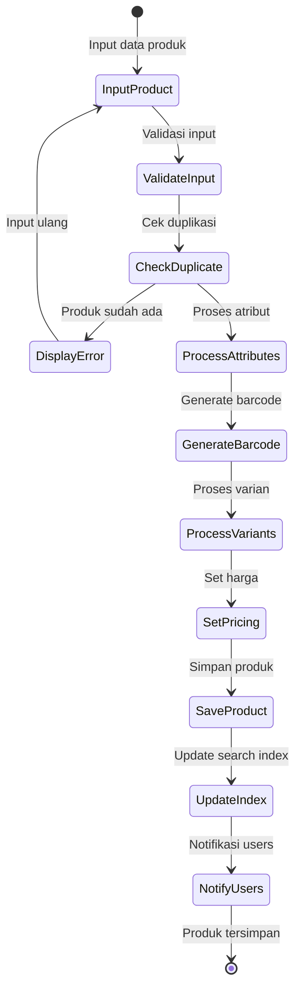

### 1.2 Manajemen Stok
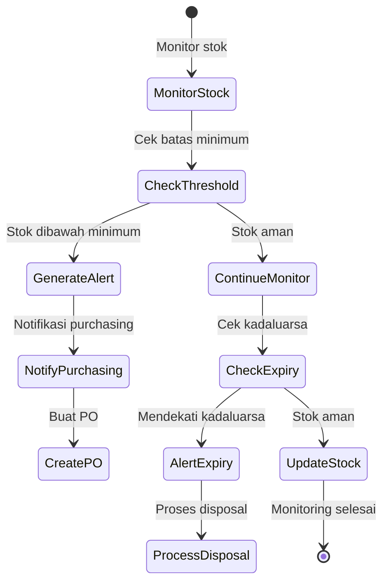

### 1.3 Import Produk
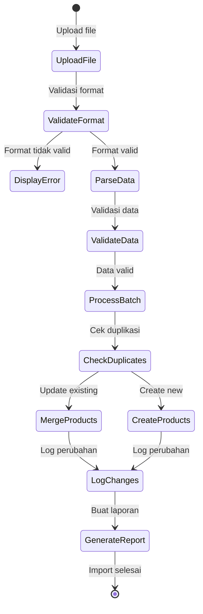

## 2. Sales Transaction

### 2.1 Proses Penjualan
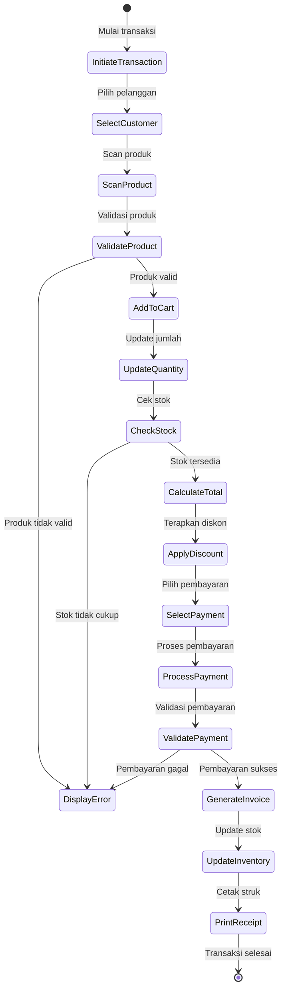

### 2.2 Split Payment
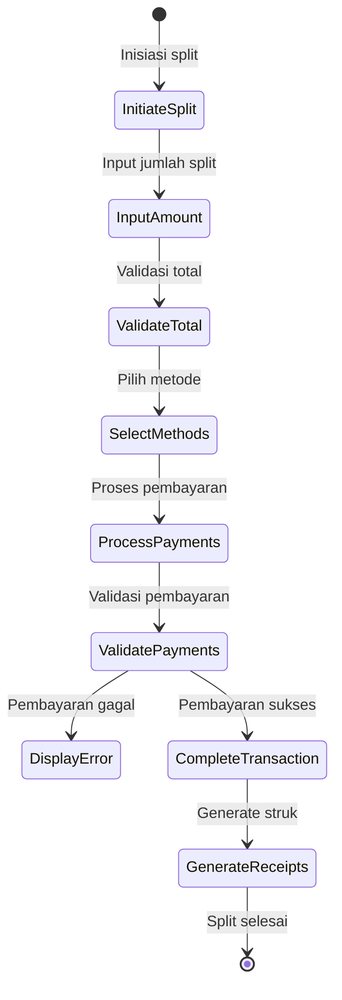

### 2.3 Reservasi Meja
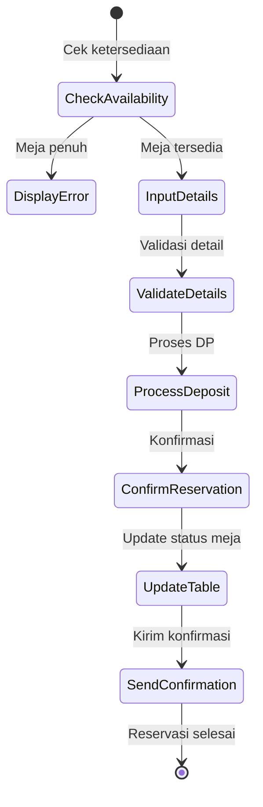

## 3. Payment Management

### 3.1 Proses Pembayaran
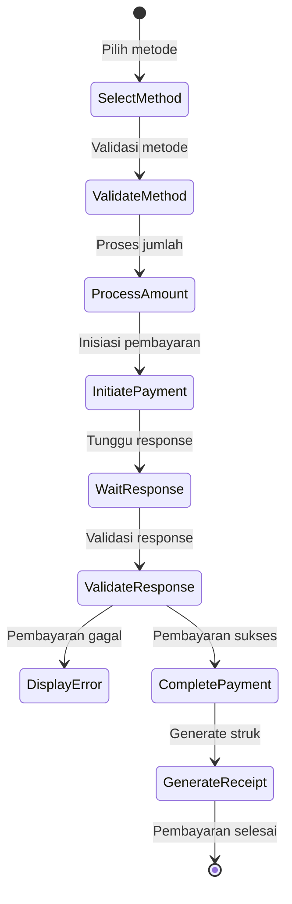

### 3.2 Rekonsiliasi Bank
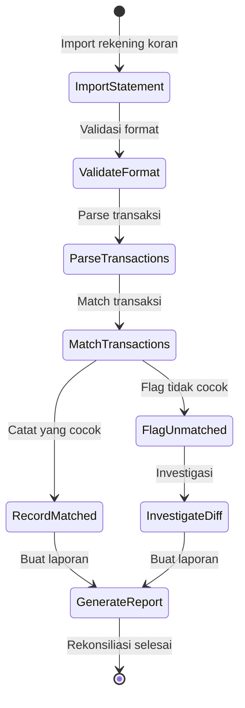

## 4. Inventory Management

### 4.1 Transfer Stok
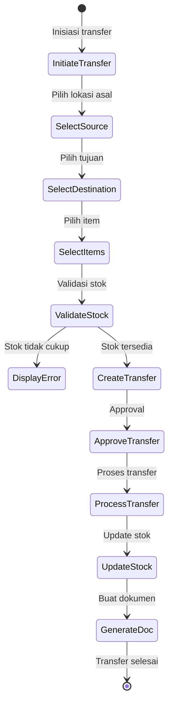

### 4.2 Audit Inventory
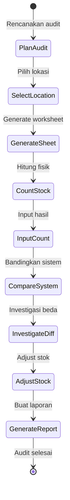

## 5. Human Resource Management

### 5.1 Manajemen Shift
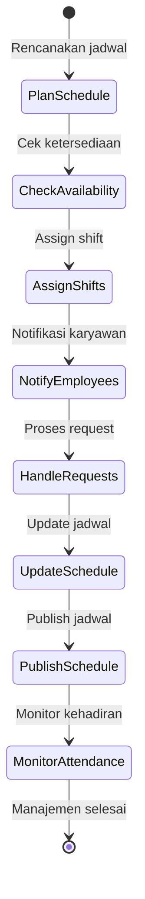

### 5.2 Manajemen Cuti
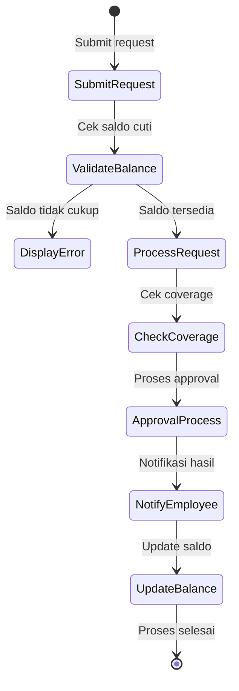

### 5.3 Penilaian Kinerja
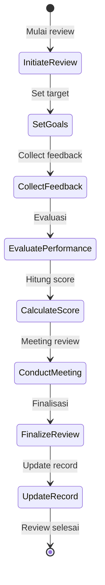

## 6. Reporting System

### 6.1 Generate Laporan
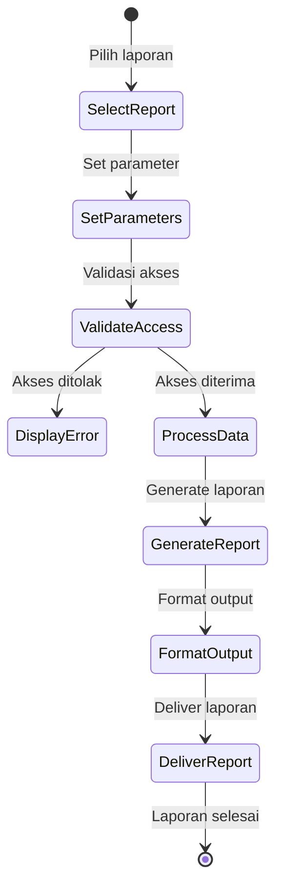

### 6.2 Analisis Data
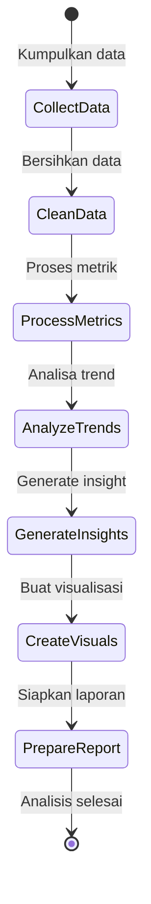
