# Activity Diagrams DearPOS

Dokumen ini berisi activity diagram untuk setiap modul dalam sistem DearPOS. Activity diagram menggambarkan alur kerja dari setiap proses bisnis utama dalam sistem.

## 1. Authentication & Authorization

### 1.1 Proses Login
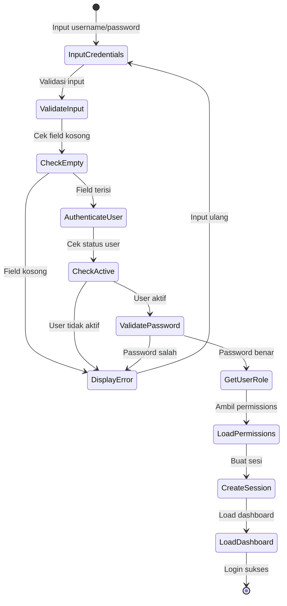

### 1.2 Proses Logout
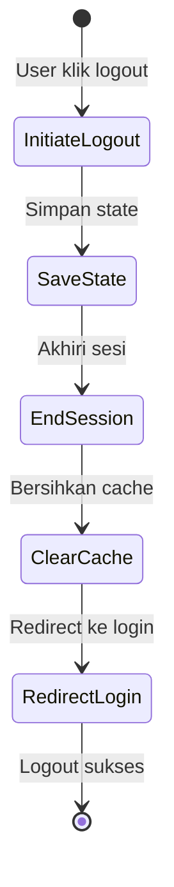

### 1.3 Reset Password
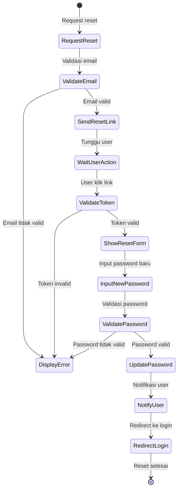

## 2. Point of Sale (POS)

### 2.1 Proses Penjualan
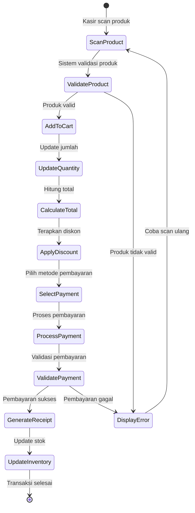

### 2.2 Proses Retur
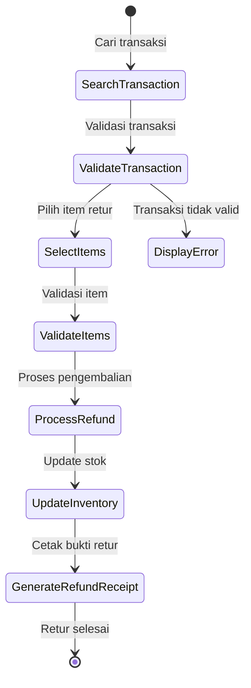

## 3. Inventory Management

### 3.1 Proses Stok Masuk
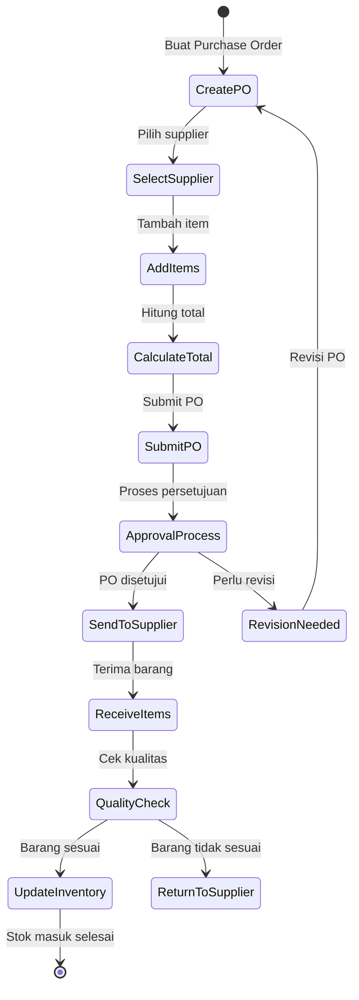

### 3.2 Stock Opname
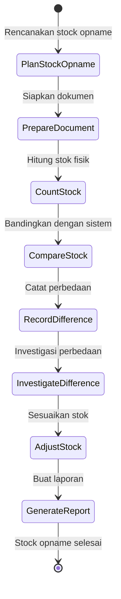

## 4. Human Resource Management

### 4.1 Proses Rekrutmen
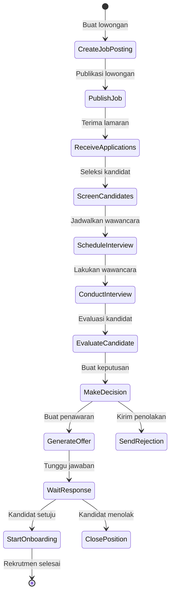

### 4.2 Proses Penggajian
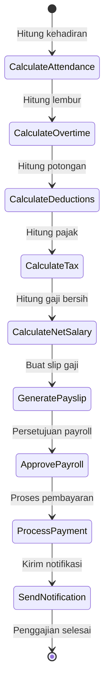

## 5. Financial Management

### 5.1 Proses Akuntansi
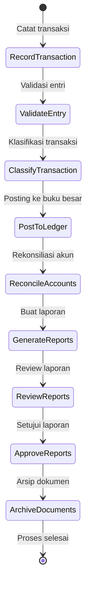

### 5.2 Proses Penagihan
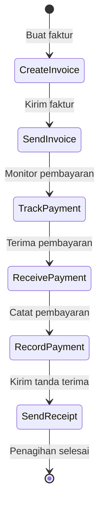

## 6. Customer Management

### 6.1 Program Loyalitas
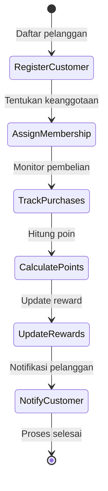

### 6.2 Manajemen Feedback
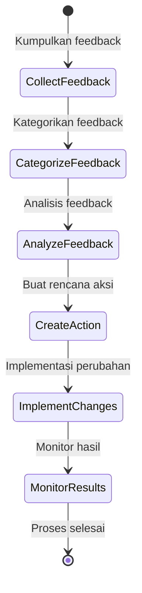

## 7. Integration & API

### 7.1 Integrasi E-commerce
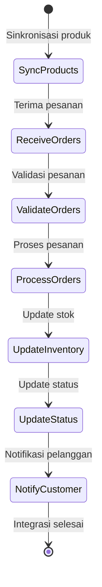

### 7.2 Integrasi Perangkat
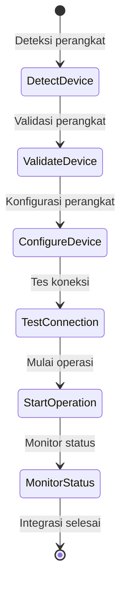

## 8. Reporting & Analytics

### 8.1 Proses Pelaporan
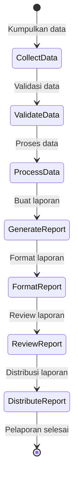

### 8.2 Analisis Bisnis
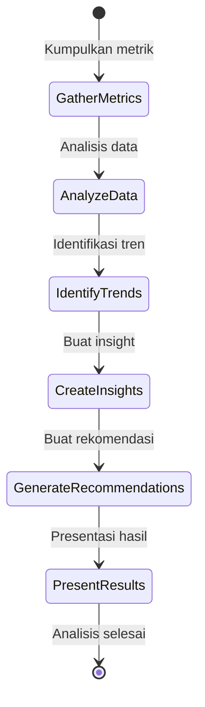

## 9. Product Management

### 9.1 Tambah Produk Baru
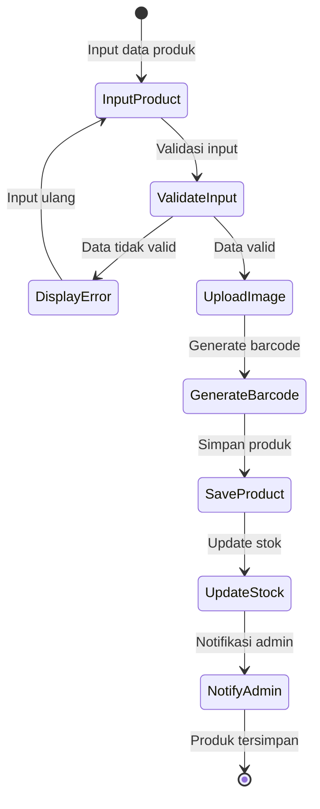

### 9.2 Manajemen Bundle
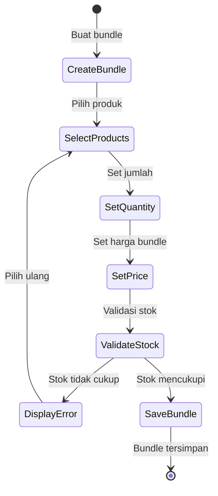

### 9.3 Manajemen Resep
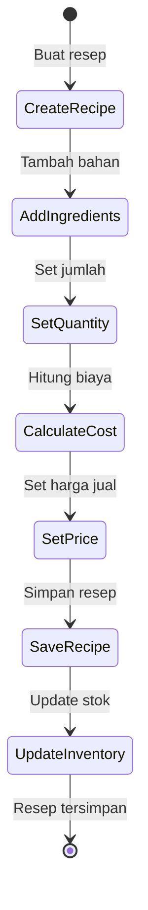

## 10. Payment Management

### 10.1 Proses QRIS
```mermaid
stateDiagram-v2
    [*] --> GenerateQR: Generate QR Code
    GenerateQR --> WaitPayment: Tunggu pembayaran
    WaitPayment --> CheckStatus: Cek status
    CheckStatus --> PaymentFailed: Pembayaran gagal
    PaymentFailed --> [*]: Transaksi gagal
    CheckStatus --> PaymentSuccess: Pembayaran sukses
    PaymentSuccess --> UpdateTransaction: Update transaksi
    UpdateTransaction --> GenerateReceipt: Generate receipt
    GenerateReceipt --> [*]: Transaksi selesai
```

### 10.2 Manajemen Cicilan
```mermaid
stateDiagram-v2
    [*] --> SetupInstallment: Setup cicilan
    SetupInstallment --> CalculateSchedule: Hitung jadwal
    CalculateSchedule --> ValidateDP: Validasi DP
    ValidateDP --> DisplayError: DP tidak valid
    DisplayError --> SetupInstallment: Setup ulang
    ValidateDP --> SaveSchedule: DP valid
    SaveSchedule --> NotifyCustomer: Notifikasi customer
    NotifyCustomer --> [*]: Cicilan tersimpan
```

## 11. Organization Management

### 11.1 Manajemen Departemen
```mermaid
stateDiagram-v2
    [*] --> CreateDepartment: Buat departemen
    CreateDepartment --> SetHierarchy: Set hirarki
    SetHierarchy --> SetBudget: Set budget
    SetBudget --> SetKPI: Set KPI
    SetKPI --> AllocateResource: Alokasi sumber daya
    AllocateResource --> SaveDepartment: Simpan departemen
    SaveDepartment --> NotifyStakeholders: Notifikasi stakeholder
    NotifyStakeholders --> [*]: Departemen tersimpan
```

### 11.2 Manajemen Posisi
```mermaid
stateDiagram-v2
    [*] --> CreatePosition: Buat posisi
    CreatePosition --> DefineJobDesc: Definisi job desc
    DefineJobDesc --> SetCompetency: Set kompetensi
    SetCompetency --> DefinePath: Definisi jalur karir
    DefinePath --> SetSalaryGrade: Set grade gaji
    SetSalaryGrade --> SavePosition: Simpan posisi
    SavePosition --> [*]: Posisi tersimpan
```

### 11.3 Manajemen Shift
```mermaid
stateDiagram-v2
    [*] --> CreateSchedule: Buat jadwal
    CreateSchedule --> AssignEmployees: Assign karyawan
    AssignEmployees --> ValidateAvailability: Validasi ketersediaan
    ValidateAvailability --> DisplayError: Tidak tersedia
    DisplayError --> AssignEmployees: Assign ulang
    ValidateAvailability --> SaveSchedule: Tersedia
    SaveSchedule --> NotifyEmployees: Notifikasi karyawan
    NotifyEmployees --> [*]: Jadwal tersimpan
```

## 12. Performance Management

### 12.1 Penilaian Kinerja
```mermaid
stateDiagram-v2
    [*] --> InitiateReview: Mulai review
    InitiateReview --> SetGoals: Set target
    SetGoals --> Collect360Feedback: Kumpulkan feedback
    Collect360Feedback --> AnalyzePerformance: Analisa kinerja
    AnalyzePerformance --> ProvideRating: Beri rating
    ProvideRating --> DiscussResults: Diskusi hasil
    DiscussResults --> SetNewGoals: Set target baru
    SetNewGoals --> SaveReview: Simpan review
    SaveReview --> [*]: Review selesai
```

### 12.2 Manajemen KPI
```mermaid
stateDiagram-v2
    [*] --> DefineKPI: Definisi KPI
    DefineKPI --> SetTarget: Set target
    SetTarget --> AssignKPI: Assign ke karyawan
    AssignKPI --> MonitorProgress: Monitor progress
    MonitorProgress --> EvaluateResults: Evaluasi hasil
    EvaluateResults --> ProvideFeedback: Beri feedback
    ProvideFeedback --> UpdateKPI: Update KPI
    UpdateKPI --> [*]: KPI tersimpan
```

## 13. Training Management

### 13.1 Program Pelatihan
```mermaid
stateDiagram-v2
    [*] --> IdentifyNeeds: Identifikasi kebutuhan
    IdentifyNeeds --> DesignProgram: Desain program
    DesignProgram --> PrepareMaterial: Siapkan materi
    PrepareMaterial --> ScheduleTraining: Jadwalkan pelatihan
    ScheduleTraining --> NotifyParticipants: Notifikasi peserta
    NotifyParticipants --> ConductTraining: Laksanakan pelatihan
    ConductTraining --> EvaluateEffectiveness: Evaluasi efektivitas
    EvaluateEffectiveness --> GenerateReport: Buat laporan
    GenerateReport --> [*]: Program selesai
```

### 13.2 Sertifikasi
```mermaid
stateDiagram-v2
    [*] --> RegisterParticipant: Daftar peserta
    RegisterParticipant --> VerifyEligibility: Verifikasi eligibilitas
    VerifyEligibility --> ConductExam: Laksanakan ujian
    ConductExam --> GradeExam: Nilai ujian
    GradeExam --> CheckPassing: Cek kelulusan
    CheckPassing --> IssueCertificate: Terbitkan sertifikat
    IssueCertificate --> UpdateRecord: Update rekaman
    UpdateRecord --> [*]: Sertifikasi selesai
```

## 14. Leave Management

### 14.1 Pengajuan Cuti
```mermaid
stateDiagram-v2
    [*] --> SubmitRequest: Ajukan cuti
    SubmitRequest --> CheckBalance: Cek saldo cuti
    CheckBalance --> InsufficientBalance: Saldo tidak cukup
    InsufficientBalance --> [*]: Pengajuan ditolak
    CheckBalance --> ValidateSchedule: Saldo cukup
    ValidateSchedule --> ScheduleConflict: Jadwal bentrok
    ScheduleConflict --> [*]: Pengajuan ditolak
    ValidateSchedule --> ApprovalProcess: Jadwal tersedia
    ApprovalProcess --> SupervisorApproval: Persetujuan supervisor
    SupervisorApproval --> UpdateBalance: Persetujuan diterima
    UpdateBalance --> NotifyEmployee: Notifikasi karyawan
    NotifyEmployee --> [*]: Pengajuan selesai
```

### 14.2 Manajemen Saldo Cuti
```mermaid
stateDiagram-v2
    [*] --> CalculateEntitlement: Hitung hak cuti
    CalculateEntitlement --> UpdateBalance: Update saldo
    UpdateBalance --> CheckExpiry: Cek kadaluarsa
    CheckExpiry --> ExpireLeave: Hapus cuti kadaluarsa
    ExpireLeave --> NotifyEmployee: Notifikasi karyawan
    NotifyEmployee --> GenerateReport: Buat laporan
    GenerateReport --> [*]: Update selesai
```

## 15. Payroll Management

### 15.1 Proses Penggajian
```mermaid
stateDiagram-v2
    [*] --> CalculateBasic: Hitung gaji pokok
    CalculateBasic --> AddAllowances: Tambah tunjangan
    AddAllowances --> CalculateOvertime: Hitung lembur
    CalculateOvertime --> CalculateDeductions: Hitung potongan
    CalculateDeductions --> CalculateTax: Hitung pajak
    CalculateTax --> GeneratePayslip: Buat slip gaji
    GeneratePayslip --> ProcessPayment: Proses pembayaran
    ProcessPayment --> NotifyEmployee: Notifikasi karyawan
    NotifyEmployee --> [*]: Penggajian selesai
```

### 15.2 Manajemen Tunjangan
```mermaid
stateDiagram-v2
    [*] --> SetupBenefit: Setup tunjangan
    SetupBenefit --> DefineEligibility: Definisi eligibilitas
    DefineEligibility --> CalculateCost: Hitung biaya
    CalculateCost --> AssignEmployees: Assign karyawan
    AssignEmployees --> ProcessClaims: Proses klaim
    ProcessClaims --> ValidateClaims: Validasi klaim
    ValidateClaims --> ReimburseBenefit: Reimburse tunjangan
    ReimburseBenefit --> [*]: Proses selesai
```
