# Class Diagram DearPOS

Dokumen ini menjelaskan struktur class yang digunakan dalam sistem DearPOS. Class diagram ini menggambarkan hubungan dan interaksi antar komponen dalam sistem.

## Komponen Utama

### Internationalization (i18n)
Komponen ini menangani fitur multi bahasa dan lokalisasi dalam sistem:
- **Language**: Mengelola bahasa yang didukung sistem
- **Translation**: Mengelola terjemahan string dan konten
- **RegionalSettings**: Mengatur format regional seperti tanggal dan mata uang
- **TranslatedContent**: Mengelola konten yang diterjemahkan
- **LocalizationService**: Service untuk operasi lokalisasi

### Product Management
Mengelola produk dan informasi terkait:
- **Product**: Data dan operasi produk
- **ProductPrice**: Harga produk dalam berbagai mata uang
- **Bundle**: Produk yang terdiri dari beberapa produk lain
- **Recipe**: Resep atau komposisi produk

### Currency Management
Mengelola mata uang dan konversi:
- **Currency**: Informasi mata uang
- **ExchangeRate**: Kurs mata uang
- **CurrencyConversion**: Konversi antar mata uang
- **ProductPrice**: Harga produk per mata uang

### Sales & Payment
Mengelola transaksi penjualan dan pembayaran:
- **SalesTransaction**: Transaksi penjualan
- **Payment**: Pembayaran
- **POSOperations**: Operasi point of sale
- **FinancialManagement**: Manajemen keuangan

### Integration & Services
Komponen integrasi dan layanan:
- **APIPlatform**: Platform API
- **SecurityCompliance**: Keamanan sistem
- **MobileSolutions**: Solusi mobile
- **EcommerceIntegration**: Integrasi e-commerce
- **BusinessIntelligence**: Analisis bisnis

### Human Resource Management
Mengelola sumber daya manusia dan informasi terkait:
- **Employee**: Data dan operasi karyawan
- **Role**: Data dan operasi peran
- **Department**: Data dan operasi departemen
- **Position**: Data dan operasi posisi
- **Attendance**: Data dan operasi kehadiran
- **Shift**: Data dan operasi shift
- **LeaveRequest**: Data dan operasi permohonan cuti
- **Payroll**: Data dan operasi gaji
- **PerformanceReview**: Data dan operasi penilaian kinerja
- **PerformanceGoal**: Data dan operasi tujuan kinerja
- **TrainingProgram**: Data dan operasi program pelatihan
- **JobPosting**: Data dan operasi lowongan pekerjaan
- **Candidate**: Data dan operasi kandidat
- **HRAnalytics**: Data dan operasi analisis HR
- **EmployeeTask**: Data dan operasi tugas karyawan

## Class Diagram

```mermaid
classDiagram
    %% Internationalization
    class Language {
        +String code
        +String name
        +String nativeName
        +String direction
        +Boolean isDefault
        +Boolean isActive
        ---
        +createLanguage()
        +updateLanguage()
        +setAsDefault()
        +validateCode()
        +getAvailableLanguages()
    }

    class Translation {
        +Language language
        +String namespace
        +String key
        +String value
        +String contextHint
        +List~TranslationHistory~ history
        ---
        +addTranslation()
        +updateTranslation()
        +importTranslations()
        +exportTranslations()
        +trackChanges()
    }

    class RegionalSettings {
        +Language language
        +String dateFormat
        +String timeFormat
        +String numberFormat
        +String addressFormat
        +String phoneFormat
        +String measurementUnit
        +String calendarType
        ---
        +setFormats()
        +validateFormats()
        +applyFormats()
        +getLocalizedFormats()
    }

    class TranslatedContent {
        +String referenceId
        +String referenceType
        +Language language
        +String fieldName
        +String content
        ---
        +setContent()
        +getContent()
        +validateContent()
        +syncTranslations()
    }

    class LocalizationService {
        +Language currentLanguage
        +RegionalSettings currentSettings
        +List~Translation~ translations
        ---
        +translate(key)
        +formatDate(date)
        +formatNumber(number)
        +formatAddress(address)
        +formatPhone(phone)
        +switchLanguage(lang)
        +loadTranslations()
    }

    %% Product Management
    class Product {
        +String sku
        +Currency baseCurrency
        +Decimal basePrice
        +Integer stock
        +String barcode
        +String imageURL
        +Boolean isBundle
        +Date expiryDate
        +List~Product~ bundleItems
        +List~String~ recipes
        +List~ProductPrice~ prices
        +List~TranslatedContent~ translations
        ---
        +createProduct()
        +updateProduct()
        +deleteProduct()
        +manageStock()
        +generateBarcode()
        +trackStockHistory()
        +manageBundles()
        +trackExpiry()
        +manageRecipes()
        +setPriceInCurrency()
        +getPriceInCurrency()
        +setTranslation()
        +getTranslation()
    }

    %% Currency Management
    class Currency {
        +String code
        +String name
        +String symbol
        +Integer decimalPlaces
        +Boolean isBaseCurrency
        +Boolean isActive
        ---
        +createCurrency()
        +updateCurrency()
        +setAsBaseCurrency()
        +validateCode()
        +getExchangeRates()
    }

    class ExchangeRate {
        +Currency fromCurrency
        +Currency toCurrency
        +Decimal rate
        +Date effectiveDate
        +String source
        ---
        +updateRate()
        +validateRate()
        +getHistoricalRates()
        +calculateConversion()
    }

    class CurrencyConversion {
        +Currency fromCurrency
        +Currency toCurrency
        +Decimal amount
        +Decimal convertedAmount
        +Decimal fee
        ---
        +convert()
        +calculateFee()
        +applyRules()
        +validateConversion()
    }

    class ProductPrice {
        +Product product
        +Currency currency
        +Decimal price
        +Boolean isActive
        ---
        +setPrice()
        +updatePrice()
        +validatePrice()
        +calculateMarkup()
    }

    %% Sales & Payment
    class SalesTransaction {
        +String transactionId
        +Date transactionDate
        +List~Product~ items
        +Currency currency
        +Decimal totalAmount
        +String status
        ---
        +createTransaction()
        +addItem()
        +removeItem()
        +calculateTotal()
        +processPayment()
        +generateReceipt()
    }

    class Payment {
        +String paymentId
        +SalesTransaction transaction
        +Currency currency
        +Decimal amount
        +String method
        +String status
        ---
        +processPayment()
        +validatePayment()
        +recordPayment()
        +generateReceipt()
    }

    %% Integration & Services
    class APIPlatform {
        +String version
        +List~String~ endpoints
        +Boolean isActive
        ---
        +handleRequest()
        +validateRequest()
        +generateResponse()
        +manageEndpoints()
    }

    class SecurityCompliance {
        +List~String~ policies
        +List~String~ permissions
        +Boolean isEnabled
        ---
        +enforcePolicy()
        +validateAccess()
        +auditActivity()
        +managePermissions()
    }

    class MobileSolutions {
        +String platform
        +String version
        +Boolean isActive
        ---
        +syncData()
        +handleNotifications()
        +manageUpdates()
        +trackUsage()
    }

    class EcommerceIntegration {
        +String platform
        +Boolean isActive
        +List~String~ endpoints
        ---
        +syncProducts()
        +processOrders()
        +updateInventory()
        +manageWebhooks()
    }

    class BusinessIntelligence {
        +List~String~ metrics
        +List~String~ reports
        +Boolean isActive
        ---
        +generateReport()
        +analyzeData()
        +exportData()
        +scheduleReports()
    }

    %% Human Resource Management
    class Employee {
        +String employeeCode
        +String firstName
        +String lastName
        +String email
        +String phone
        +String address
        +Date birthDate
        +String gender
        +String maritalStatus
        +String nationalId
        +String taxId
        +String bankAccount
        +Department department
        +Position position
        +Role role
        +String employmentStatus
        +Date joinDate
        +Date endDate
        +Boolean isActive
        +List~Document~ documents
        +List~Benefit~ benefits
        ---
        +updateProfile()
        +assignPosition()
        +assignRole()
        +transferDepartment()
        +terminateEmployee()
        +calculateSalary()
        +requestLeave()
        +checkAttendance()
        +enrollTraining()
        +setGoals()
        +viewTasks()
    }

    class Role {
        +String code
        +String name
        +List~String~ permissions
        +Boolean isActive
        ---
        +assignPermission()
        +revokePermission()
        +validateAccess()
        +generateReport()
    }

    class Department {
        +String code
        +Department parent
        +List~Position~ positions
        +List~Employee~ employees
        +String budgetCode
        +Decimal annualBudget
        +Boolean isActive
        ---
        +addPosition()
        +assignManager()
        +transferEmployee()
        +manageBudget()
        +generateReport()
    }

    class Position {
        +String code
        +Department department
        +String jobDescription
        +String requirements
        +String salaryGrade
        +Boolean isActive
        ---
        +assignEmployee()
        +updateRequirements()
        +createJobPosting()
        +calculateSalaryRange()
    }

    class Attendance {
        +Employee employee
        +DateTime checkIn
        +DateTime checkOut
        +String status
        +String notes
        ---
        +recordCheckIn()
        +recordCheckOut()
        +calculateHours()
        +validateAttendance()
        +generateReport()
    }

    class Shift {
        +String name
        +Time startTime
        +Time endTime
        +Integer maxEmployees
        +Boolean isActive
        ---
        +assignEmployee()
        +generateSchedule()
        +calculateOvertime()
        +validateCoverage()
    }

    class LeaveRequest {
        +Employee employee
        +LeaveType type
        +Date startDate
        +Date endDate
        +String status
        +String reason
        +String notes
        +Employee approver
        +DateTime approvedAt
        ---
        +submitRequest()
        +approveRequest()
        +rejectRequest()
        +cancelRequest()
        +calculateBalance()
    }

    class Payroll {
        +Employee employee
        +Date periodStart
        +Date periodEnd
        +Decimal basicSalary
        +Decimal allowances
        +Decimal deductions
        +Decimal overtimePay
        +Decimal bonus
        +Decimal tax
        +Decimal netSalary
        +String status
        +Employee approver
        +DateTime approvedAt
        ---
        +calculateSalary()
        +processPayroll()
        +generatePayslip()
        +recordPayment()
        +validateCalculations()
    }

    class PerformanceReview {
        +Employee employee
        +Employee reviewer
        +Date reviewDate
        +String reviewPeriod
        +Decimal rating
        +String comments
        +String status
        +Employee approver
        +DateTime approvedAt
        ---
        +submitReview()
        +approveReview()
        +setGoals()
        +trackProgress()
        +generateReport()
    }

    class PerformanceGoal {
        +Employee employee
        +String type
        +String description
        +String metrics
        +Date targetDate
        +String status
        +Decimal achievement
        ---
        +setGoal()
        +updateProgress()
        +evaluateAchievement()
        +generateReport()
    }

    class TrainingProgram {
        +String code
        +String name
        +String description
        +Date startDate
        +Date endDate
        +String trainer
        +String location
        +Decimal cost
        +Integer capacity
        +Boolean isMandatory
        +Boolean isActive
        ---
        +scheduleTraining()
        +enrollParticipants()
        +recordAttendance()
        +evaluateEffectiveness()
        +generateReport()
    }

    class JobPosting {
        +Position position
        +String status
        +Date postingDate
        +Date closingDate
        +Integer vacancies
        +String requirements
        +String description
        +Decimal budget
        ---
        +publishPosting()
        +closePosting()
        +screenCandidates()
        +scheduleInterviews()
        +trackBudget()
    }

    class Candidate {
        +JobPosting jobPosting
        +String firstName
        +String lastName
        +String email
        +String phone
        +String resumeUrl
        +String status
        +String notes
        ---
        +submitApplication()
        +updateStatus()
        +scheduleInterview()
        +generateOffer()
        +trackProgress()
    }

    class HRAnalytics {
        +List~Metric~ metrics
        +List~Report~ reports
        ---
        +analyzeWorkforce()
        +analyzePerformance()
        +analyzeRecruitment()
        +analyzeCosts()
        +generateReport()
        +forecastTrends()
    }

    class EmployeeTask {
        +Employee employee
        +Employee assignedBy
        +String title
        +String description
        +Date dueDate
        +String priority
        +String status
        +DateTime completedAt
        ---
        +assignTask()
        +updateStatus()
        +markComplete()
        +trackProgress()
        +generateReport()
    }

    %% Relationships
    Employee --> Department : "belongs to"
    Employee --> Position : "holds"
    Employee --> Role : "has"
    Employee --> Attendance : "records"
    Employee --> LeaveRequest : "submits"
    Employee --> Payroll : "receives"
    Employee --> PerformanceReview : "undergoes"
    Employee --> PerformanceGoal : "sets"
    Employee --> TrainingProgram : "participates in"
    Employee --> EmployeeTask : "assigned"
    
    Role --> Employee : "assigned to"
    
    Department --> Position : "contains"
    Department --> Department : "has parent"
    Position --> JobPosting : "advertised as"
    JobPosting --> Candidate : "receives"
    
    HRAnalytics --> Employee : "analyzes"
    HRAnalytics --> Department : "analyzes"
    HRAnalytics --> Payroll : "analyzes"
    HRAnalytics --> PerformanceReview : "analyzes"
    HRAnalytics --> Recruitment : "analyzes"

```

## Catatan Implementasi

1. **Internationalization**
   - Setiap konten yang perlu diterjemahkan menggunakan `TranslatedContent`
   - Format regional diatur melalui `RegionalSettings`
   - `LocalizationService` menangani semua operasi terkait lokalisasi

2. **Product Management**
   - Produk mendukung multi bahasa dan multi mata uang
   - Harga produk dapat diatur dalam berbagai mata uang
   - Mendukung produk bundle dan resep

3. **Currency Management**
   - Mendukung multiple mata uang
   - Kurs mata uang dapat diperbarui secara berkala
   - Konversi mata uang otomatis

4. **Sales & Payment**
   - Transaksi dapat dilakukan dalam berbagai mata uang
   - Pembayaran mendukung berbagai metode
   - Terintegrasi dengan manajemen keuangan

5. **Integration & Services**
   - API platform sebagai pusat integrasi
   - Keamanan ditangani oleh `SecurityCompliance`
   - Mendukung integrasi mobile dan e-commerce
   - Business intelligence untuk analisis data

6. **Human Resource Management**
   - Mengelola data karyawan, departemen, dan posisi
   - Mendukung pengelolaan kehadiran, cuti, dan gaji
   - Terintegrasi dengan analisis HR untuk pengambilan keputusan
