# Class Diagram DearPOS

Dokumen ini menjelaskan struktur class yang digunakan dalam sistem DearPOS. Class diagram ini menggambarkan hubungan dan interaksi antar komponen dalam sistem.

## Komponen Utama

### Internationalization (i18n)
Komponen ini menangani fitur multi bahasa dan lokalisasi dalam sistem:
- **Language**: Mengelola bahasa yang didukung sistem
- **Translation**: Mengelola terjemahan string dan konten
- **RegionalSettings**: Mengatur format regional seperti tanggal dan mata uang
- **TranslatedContent**: Mengelola konten yang diterjemahkan
- **LocalizationService**: Service untuk operasi lokalisasi

### Product Management
Mengelola produk dan informasi terkait:
- **Product**: Data dan operasi produk
- **ProductPrice**: Harga produk dalam berbagai mata uang
- **Bundle**: Produk yang terdiri dari beberapa produk lain
- **Recipe**: Resep atau komposisi produk

### Currency Management
Mengelola mata uang dan konversi:
- **Currency**: Informasi mata uang
- **ExchangeRate**: Kurs mata uang
- **CurrencyConversion**: Konversi antar mata uang
- **ProductPrice**: Harga produk per mata uang

### Sales & Payment
Mengelola transaksi penjualan dan pembayaran:
- **SalesTransaction**: Transaksi penjualan
- **Payment**: Pembayaran
- **POSOperations**: Operasi point of sale
- **FinancialManagement**: Manajemen keuangan

### Integration & Services
Komponen integrasi dan layanan:
- **APIPlatform**: Platform API
- **SecurityCompliance**: Keamanan sistem
- **MobileSolutions**: Solusi mobile
- **EcommerceIntegration**: Integrasi e-commerce
- **BusinessIntelligence**: Analisis bisnis

### Human Resource Management
Mengelola sumber daya manusia dan informasi terkait:
- **Employee**: Data dan operasi karyawan
- **Role**: Data dan operasi peran
- **Department**: Data dan operasi departemen
- **Position**: Data dan operasi posisi
- **Attendance**: Data dan operasi kehadiran
- **Shift**: Data dan operasi shift
- **LeaveRequest**: Data dan operasi permohonan cuti
- **Payroll**: Data dan operasi gaji
- **PerformanceReview**: Data dan operasi penilaian kinerja
- **PerformanceGoal**: Data dan operasi tujuan kinerja
- **TrainingProgram**: Data dan operasi program pelatihan
- **JobPosting**: Data dan operasi lowongan pekerjaan
- **Candidate**: Data dan operasi kandidat
- **HRAnalytics**: Data dan operasi analisis HR
- **EmployeeTask**: Data dan operasi tugas karyawan

## Class Diagram

```mermaid
classDiagram
    %% Core Domain Models
    class BaseModel {
        +UUID id
        +DateTime createdAt
        +DateTime updatedAt
        +DateTime deletedAt
        +User createdBy
        +User updatedBy
        +User deletedBy
        ---
        +create()
        +update()
        +delete()
        +restore()
    }

    %% Product Management
    class Product {
        +String name
        +String sku
        +String description
        +Category category
        +Currency baseCurrency
        +UnitOfMeasure baseUnit
        +Boolean isRecipeManaged
        +Boolean trackExpiry
        +Boolean trackSerial
        +List~Price~ prices
        +List~Attribute~ attributes
        +List~Variant~ variants
        +List~Barcode~ barcodes
        +List~Image~ images
        +MarketplaceProduct marketplaceInfo
        ---
        +addPrice(Price)
        +updatePrice(Price)
        +addVariant(Variant)
        +updateStock(Movement)
        +checkStock()
        +generateBarcode()
        +addImage(Image)
        +syncWithMarketplace()
    }

    %% Marketplace Integration
    class MarketplaceIntegration {
        +String platformName
        +String apiKey
        +String secretKey
        +Boolean isActive
        ---
        +syncProducts()
        +syncOrders()
        +updateInventory()
        +handleWebhooks()
    }

    class MarketplaceProduct {
        +Product product
        +String marketplaceId
        +String marketplaceSku
        +Decimal marketplacePrice
        +Boolean isActive
        ---
        +sync()
        +updatePrice()
        +updateStock()
    }

    class MarketplaceOrder {
        +String orderId
        +String status
        +DateTime orderDate
        +List~OrderItem~ items
        ---
        +process()
        +updateStatus()
        +syncWithLocal()
    }

    %% Kitchen Management
    class KitchenManagement {
        +List~Recipe~ activeRecipes
        +List~PrepTime~ prepTimes
        ---
        +displayOrders()
        +trackPrepTime()
        +updateStatus()
    }

    class CookingTimeTracker {
        +Recipe recipe
        +DateTime startTime
        +DateTime endTime
        +Employee cook
        ---
        +startTracking()
        +endTracking()
        +calculateDuration()
    }

    class KitchenDisplay {
        +List~Order~ pendingOrders
        +List~Recipe~ activeRecipes
        ---
        +showQueue()
        +updateStatus()
        +markComplete()
    }

    %% Warehouse Operations
    class WarehouseOperation {
        +Location warehouse
        +DateTime operationDate
        +String type
        +String status
        ---
        +process()
        +validate()
        +complete()
    }

    class ReceivingManagement {
        +PurchaseOrder order
        +List~ReceiveItem~ items
        +DateTime receivedDate
        ---
        +receiveItems()
        +validateQuantity()
        +updateInventory()
    }

    class PutAwayOptimization {
        +List~StorageLocation~ locations
        +List~Product~ products
        ---
        +suggestLocation()
        +optimizeSpace()
        +generatePutAwayTask()
    }

    class CrossDocking {
        +InboundShipment inbound
        +OutboundOrder outbound
        +List~Product~ items
        ---
        +matchOrders()
        +processCrossDock()
        +updateInventory()
    }

    %% Enhanced Payment Management
    class QRISPayment {
        +String qrisCode
        +Decimal amount
        +DateTime expiry
        +String status
        ---
        +generateQR()
        +validatePayment()
        +checkStatus()
    }

    class DownPaymentConfig {
        +Product product
        +Decimal percentage
        +Decimal minimumAmount
        ---
        +calculate()
        +validate()
        +apply()
    }

    class PaymentSchedule {
        +Order order
        +List~InstallmentPlan~ installments
        +Decimal totalAmount
        ---
        +generateSchedule()
        +trackPayments()
        +sendReminders()
    }

    class BankReconciliation {
        +BankStatement statement
        +List~Transaction~ transactions
        +DateTime period
        ---
        +matchTransactions()
        +flagDiscrepancies()
        +generateReport()
    }

    %% Enhanced HR Management
    class SkillMatrix {
        +Employee employee
        +List~Skill~ skills
        +List~Certification~ certifications
        ---
        +assessSkills()
        +updateMatrix()
        +generateReport()
    }

    class LaborTimeStandard {
        +Task task
        +Duration standardTime
        +List~TimeStudy~ studies
        ---
        +calculateStandard()
        +trackPerformance()
        +updateStandards()
    }

    class MechanicSchedule {
        +Employee mechanic
        +List~Task~ tasks
        +DateTime scheduleDate
        ---
        +assignTasks()
        +optimizeSchedule()
        +trackProgress()
    }

    class EmergencyContact {
        +Employee employee
        +String contactName
        +String relationship
        +String phone
        +String address
        ---
        +validate()
        +update()
        +notify()
    }

    %% Relationships
    BaseModel <|-- Product
    BaseModel <|-- MarketplaceIntegration
    BaseModel <|-- MarketplaceProduct
    BaseModel <|-- MarketplaceOrder
    BaseModel <|-- KitchenManagement
    BaseModel <|-- WarehouseOperation
    BaseModel <|-- QRISPayment
    BaseModel <|-- SkillMatrix

    Product "1" -- "*" MarketplaceProduct
    MarketplaceIntegration "1" -- "*" MarketplaceProduct
    MarketplaceIntegration "1" -- "*" MarketplaceOrder
    
    KitchenManagement "1" -- "*" CookingTimeTracker
    KitchenManagement "1" -- "1" KitchenDisplay
    
    WarehouseOperation <|-- ReceivingManagement
    WarehouseOperation <|-- PutAwayOptimization
    WarehouseOperation <|-- CrossDocking
    
    SkillMatrix "1" -- "1" Employee
    Employee "1" -- "*" EmergencyContact
    Employee "1" -- "*" MechanicSchedule
    Employee "1" -- "*" LaborTimeStandard
```

## Catatan Implementasi

1. **Base Model**
   - Semua model mewarisi dari `BaseModel` yang menyediakan fungsionalitas dasar seperti timestamps dan soft delete
   - Menggunakan UUID sebagai primary key untuk memudahkan replikasi

2. **Product Management**
   - Implementasi flexible attribute system untuk menangani variasi produk
   - Support untuk multiple pricing berdasarkan mata uang dan periode
   - Manajemen varian produk yang terstruktur

3. **Inventory Management**
   - Event-based system untuk tracking pergerakan inventory
   - Support untuk lot dan serial number tracking
   - Multi-location inventory management

4. **Sales Management**
   - Flexible order system dengan support untuk multiple items
   - Comprehensive payment tracking dengan installment support
   - Table management dengan reservation system

5. **Employee Management**
   - Hierarchical department and position management
   - Comprehensive employee information management
   - Flexible shift management system

6. **Audit System**
   - Comprehensive tracking untuk semua perubahan entity
   - JSON-based change tracking untuk flexibility
